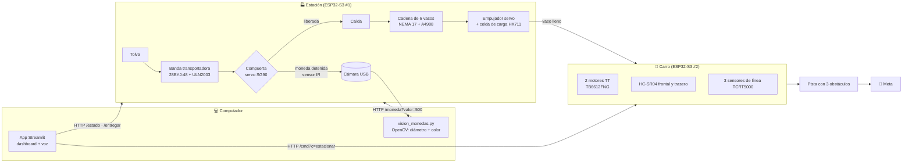
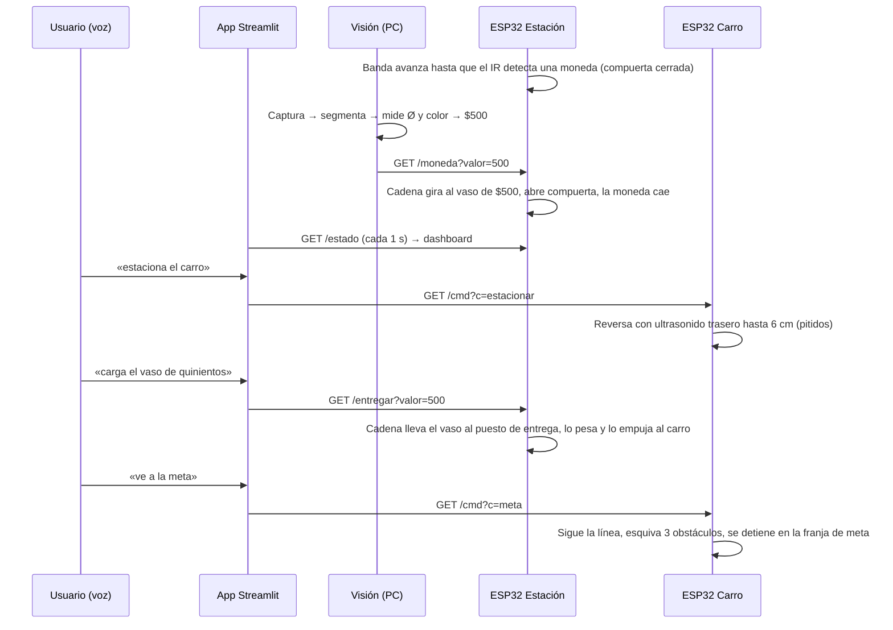
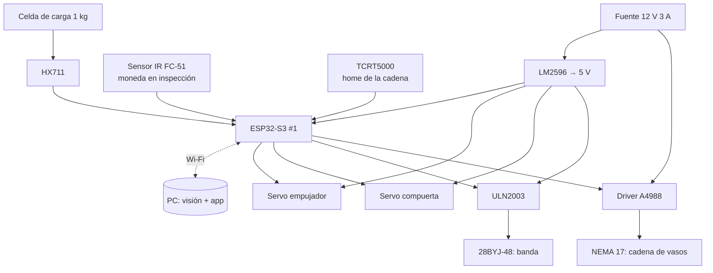
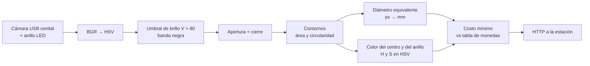
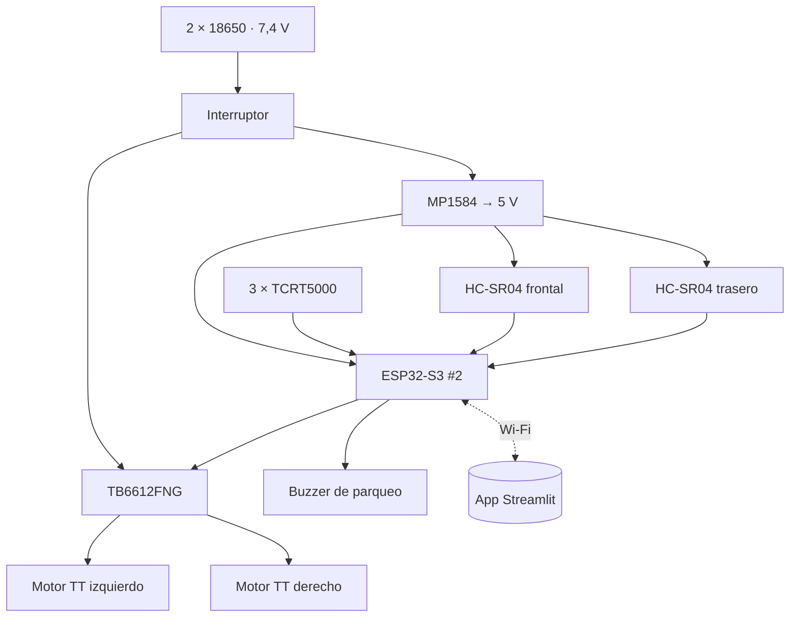
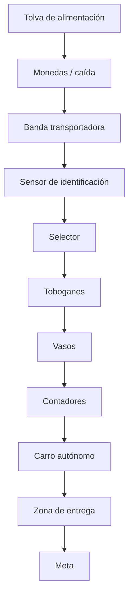

# 🪙 Sistema de Logística de Monedas Inteligentes — Grupo 5

**Segundo parcial · Microcontroladores · Universidad Militar Nueva Granada**

> **Elemento diferencial del grupo (5):** *Selector en cadena de vasos de moneda por visión computacional → control por ESP32 → aparcamiento por voz.*

---

## Contenido

1. [Resumen](#1-resumen)
2. [Alcance y decisiones de diseño](#2-alcance-y-decisiones-de-diseño)
3. [Arquitectura del sistema](#3-arquitectura-del-sistema)
4. [Requerimientos funcionales y no funcionales](#4-requerimientos-funcionales-y-no-funcionales)
5. [Diagramas de bloques por módulo](#5-diagramas-de-bloques-por-módulo)
6. [Selección y justificación de materiales](#6-selección-y-justificación-de-materiales)
7. [Diseño mecánico y CAD del carro](#7-diseño-mecánico-y-cad-del-carro)
8. [Diseño electrónico: pines y esquemas](#8-diseño-electrónico-pines-y-esquemas)
9. [Identificación visual de monedas](#9-identificación-visual-de-monedas)
10. [Firmware de las ESP32-S3](#10-firmware-de-las-esp32-s3)
11. [Aplicación Streamlit: dashboard y control por voz](#11-aplicación-streamlit-dashboard-y-control-por-voz)
12. [Simulación en PyBullet](#12-simulación-en-pybullet)
13. [Paso a paso para ejecutar](#13-paso-a-paso-para-ejecutar)
14. [Resultados de las pruebas](#14-resultados-de-las-pruebas)
15. [Qué hace falta (trabajo pendiente)](#15-qué-hace-falta-trabajo-pendiente)
16. [Estructura del repositorio](#16-estructura-del-repositorio)
17. [Evidencias](#17-evidencias)

---

## 1. Resumen

Se diseñó, simuló e implementó en firmware la parte del *Sistema de Logística de Monedas Inteligentes* que corresponde al grupo 5:

| Etapa | Qué hace | Dónde |
|---|---|---|
| **Identificación de monedas** | Una **cinta transportadora** lleva cada moneda bajo una cámara; un programa de **visión por computador** (OpenCV) la identifica por **diámetro y color** (dorado/plateado, centro y anillo). | `1_vision/` |
| **Selector en cadena de vasos** | Una **cadena con 6 vasos** (uno por denominación + rechazo) gira para poner bajo la caída el vaso correcto; la moneda cae en él. | `2_estacion_esp32/` |
| **Carro con ESP32-S3** | Carro diferencial que recibe el vaso lleno, sigue la pista y **esquiva tres obstáculos** hasta la meta. | `3_carro_esp32/`, `6_cad/` |
| **Aparcamiento por voz** | La orden hablada (*«estaciona el carro»*) se convierte en texto y el carro retrocede solo hasta la estación usando su **ultrasonido trasero**. | `4_app_streamlit/` |
| **Dashboard en tiempo real** | Streamlit muestra **cantidad, valor y peso** de las monedas, el estado de los vasos y del carro, comunicándose **por Wi-Fi** con las ESP32-S3. | `4_app_streamlit/` |
| **Simulación** | Todo el flujo funciona en **PyBullet**, usando el **mismo código de visión** que la cámara real. | `5_simulacion/` |

---

## 2. Alcance y decisiones de diseño

La arquitectura general del parcial tiene cinco bloques: **contador de monedas → transporte y embalaje → carro → pista con obstáculos → dashboard y chatbot**. Sobre esa base, el grupo tomó estas decisiones:

1. **Identificación por cinta transportadora y visión (en lugar del contador por ranuras).** Las monedas entran una a una a una banda negra. Una compuerta las detiene bajo la cámara, el PC las identifica y la ESP32 decide a qué vaso van. Esto permite saber la **denominación exacta**, y con ella el **valor** y el **peso** de cada moneda, que son las variables que pide el dashboard.
2. **Selector en cadena de vasos (elemento diferencial 5).** En lugar de un actuador por denominación, una sola caída alimenta una **cadena cerrada con 6 vasos**. La cadena gira por el camino más corto hasta dejar el vaso correcto bajo la caída. Con un solo motor paso a paso se clasifican las 5 denominaciones más el rechazo.
3. **Control por ESP32 y aparcamiento por voz.** El carro no se conduce con un joystick. Recibe **órdenes habladas** desde la app (*estacionar, cargar, meta, alto, adelante…*). El aparcamiento es **automático**: en reversa, con el HC-SR04 trasero y un pitido de sensor de parqueo, se detiene a 6 cm de la estación.
4. **Comunicación inalámbrica por Wi-Fi (HTTP).** Cada ESP32-S3 tiene un pequeño servidor web (`/estado`, `/moneda`, `/entregar`, `/cmd`). La app de Streamlit y el programa de visión le hablan por HTTP. Si no hay red, cada placa crea su propio punto de acceso.
5. **Simulación primero.** Todo se validó en PyBullet a **escala 4:1**. La cámara virtual genera imágenes que se clasifican con `vision_monedas.py`, el mismo archivo que se usa con la cámara real.

---

## 3. Arquitectura del sistema



### Secuencia de operación



---

## 4. Requerimientos funcionales y no funcionales

### Funcionales

| ID | Requerimiento | Cómo se cumple |
|---|---|---|
| RF-01 | Identificar las monedas colombianas de $50, $100, $200, $500 y $1000 | Visión por diámetro (±0,6 mm) y color de centro y anillo |
| RF-02 | Separar cada moneda en el vaso de su denominación | Cadena de vasos indexada por motor paso a paso |
| RF-03 | Enviar a un vaso de rechazo las monedas no reconocidas | Puesto "rechazo" y *timeout* de 5 s sin respuesta de visión |
| RF-04 | Calcular cantidad, valor y peso de las monedas procesadas | Tabla de pesos oficiales + celda de carga en la entrega |
| RF-05 | Entregar un vaso lleno al carro | Empujador en el puesto de entrega + porta-vaso en el carro |
| RF-06 | Estacionar el carro en la zona de carga por orden de voz | Reconocimiento de voz en la app + reversa con HC-SR04 |
| RF-07 | Llevar el vaso a la meta esquivando 3 obstáculos | Seguidor de línea + ultrasonido frontal + maniobra de esquive |
| RF-08 | Mostrar las métricas en tiempo real | Dashboard Streamlit que consulta `/estado` cada 1 s |
| RF-09 | Comunicación inalámbrica PC ↔ ESP32 | Wi-Fi + HTTP (STA o punto de acceso propio) |

### No funcionales

| ID | Requerimiento | Valor objetivo |
|---|---|---|
| RNF-01 | Exactitud de clasificación | ≥ 95 % con iluminación controlada |
| RNF-02 | Tiempo por moneda | ≤ 8 s (inspección + indexado + caída) |
| RNF-03 | Latencia de las órdenes de voz | ≤ 2 s desde que se termina de hablar |
| RNF-04 | Precisión de aparcamiento | ± 1 cm de la distancia objetivo (6 cm) |
| RNF-05 | Autonomía del carro | ≥ 30 min con 2 × 18650 |
| RNF-06 | Seguridad | Parada ante obstáculo < 18 cm; comandos manuales temporizados |
| RNF-07 | Mantenibilidad | Pines, velocidades y umbrales agrupados como constantes al inicio de cada archivo |
| RNF-08 | Reproducibilidad | Toda la lógica probada en simulación antes del montaje |

---

## 5. Diagramas de bloques por módulo

### Estación (banda + selector en cadena)



### Visión por computador



### Carro



---

## 6. Selección y justificación de materiales

| Componente | Cant. | Selección | Justificación |
|---|---|---|---|
| Microcontrolador | 2 | **ESP32-S3 DevKitC-1** | Wi-Fi integrado para el dashboard, doble núcleo, MicroPython, muchos GPIO y ADC; el curso ya lo usa |
| Banda transportadora | 1 | 28BYJ-48 + ULN2003, banda de caucho/EVA **negra** de 40 mm | Velocidad baja y constante (~19 mm/s), barato; el negro da contraste a la visión |
| Cadena de vasos | 1 | **NEMA 17 + A4988** (1/8 de micropaso), piñón Ø40 mm, cadena/correa cerrada | Par y velocidad suficientes para mover 6 vasos con monedas (~1 s por puesto); posicionamiento en lazo abierto preciso |
| Compuerta y empujador | 2 | Servo **SG90 / MG90S** | Movimiento angular simple, control directo por PWM |
| Detección de moneda | 1 | Sensor IR **FC-51** | Detecta la moneda bajo la cámara para detener la banda |
| Referencia de la cadena | 1 | **TCRT5000** | *Homing* del puesto 0 al encender |
| Peso | 1 | Celda de carga 1 kg + **HX711** | Mide el peso real del vaso antes de entregarlo (variable "peso" del dashboard) |
| Cámara | 1 | Webcam USB 1080p + anillo LED | Resolución de ~10 px/mm a 12 cm; luz uniforme para medir el color |
| Motores del carro | 2 | **Motorreductor TT 1:48** + rueda 65 mm | Estándar, económico y con el par suficiente para 0,9 kg |
| Driver del carro | 1 | **TB6612FNG** | Lógica de 3,3 V y mayor eficiencia que el L298N (menor caída de tensión) |
| Distancia | 2 | **HC-SR04** (frontal y trasero) | El trasero hace el aparcamiento; el frontal detecta los obstáculos (ECHO con divisor a 3,3 V) |
| Línea | 3 | **TCRT5000** | Seguir la línea de la pista y detectar la franja de meta |
| Energía del carro | 1 | 2 × 18650 + **MP1584** 5 V | 7,4 V para los motores y 5 V regulados para la lógica |
| Estructura del carro | — | PLA impreso / acrílico 4 mm | Piezas del CAD de este repositorio; fáciles de fabricar |
| Vasos | 6 | Vasos de Ø70 mm | Encajan en el porta-vaso de Ø78 mm del carro |

---

## 7. Diseño mecánico y CAD del carro

El CAD está en `6_cad/` y se genera desde **una sola fuente de cotas** (`generar_cad.py`):

| Archivo | Uso |
|---|---|
| `carro.scad` | Modelo **paramétrico** para OpenSCAD (gratuito). Con la variable `pieza` se exporta cada parte imprimible: `chasis`, `piso2`, `portavaso`, `soporte_sensor` (F6 → F7 = STL) |
| `carro_ensamble.stl` | Ensamble 3D completo en mm (se abre en cualquier visor o *slicer*) |
| `carro.urdf` | Modelo para PyBullet (escala 4:1, la de la simulación) |
| `plano_carro.png` | Plano con vistas superior y lateral acotadas |

| Isométrica | Trasera (porta-vaso) |
|---|---|
|  |  |


### Cotas principales

| Parámetro | Valor |
|---|---|
| Chasis (largo × ancho) | 220 × 140 mm, dos pisos (4 mm + 3 mm) con separadores de 40 mm |
| Ruedas motrices | Ø65 mm, vía 172 mm, eje a 30 mm detrás del centro |
| Rueda loca | Bola de Ø20 mm, a 85 mm delante del centro (batalla 115 mm) |
| Porta-vaso | Ø78 mm interior × 30 mm de alto, sobre el piso superior (atrás) |
| Altura total | 119 mm (sin vaso) |
| Sensores | HC-SR04 adelante y atrás; 3 × TCRT5000 bajo la parte delantera |

**Por qué el porta-vaso va atrás:** el carro se **estaciona en reversa**, así que el porta-vaso queda pegado al empujador de la estación, y el sensor trasero mide justo esa distancia.

### Estación

| Elemento | Dimensiones reales |
|---|---|
| Banda | 400 × 40 mm, superficie negra, rodillos Ø25 mm con rodamientos 608 |
| Cámara | A 105 mm sobre la banda, en la zona de inspección (a 75 mm del final) |
| Cadena de vasos | Óvalo de 1170 mm (6 puestos cada 195 mm), piñones Ø40 mm |
| Puestos | Caída en el puesto 0; entrega en el puesto 3 (lado opuesto) |

<details>
<summary><b>Código: <code>6_cad/generar_cad.py</code></b> (genera SCAD, STL, URDF y plano)</summary>

```python
"""
generar_cad.py  -  CAD del carro recolector de vasos (Grupo 5)

Una sola fuente de verdad para el diseño mecánico del carro. A partir de las
cotas reales (en mm) este script genera:

  carro.scad           modelo paramétrico para OpenSCAD (editable; F6 + F7 exporta STL)
  carro_ensamble.stl   ensamble 3D en mm (para ver en cualquier visor/slicer)
  carro.urdf           modelo para PyBullet (escala configurable)
  plano_carro.png      plano con vistas superior y lateral acotadas

Uso:  python generar_cad.py            (escala del URDF = 4, la de la simulación)
      python generar_cad.py --escala 1 (URDF a tamaño real)
"""

import argparse
import math
import os
import struct

AQUI = os.path.dirname(os.path.abspath(__file__))

# ---------------------------------------------------------------------------
# COTAS DEL CARRO (mm). Ejes: X adelante, Y izquierda, Z arriba. Origen: centro
# del chasis inferior a nivel del piso.
# ---------------------------------------------------------------------------
L, W = 220.0, 140.0            # chasis inferior (acrilico / PLA 4 mm)
T_CHASIS = 4.0
Z_CHASIS = 42.0                # cara inferior del chasis
R_RUEDA, A_RUEDA = 32.5, 26.0  # rueda TT de 65 mm
X_EJE = -30.0                  # eje de las ruedas motrices
Y_RUEDA = W / 2 + 3 + A_RUEDA / 2
MOTOR = (65.0, 22.5, 18.8)     # motorreductor TT (largo en Y)
X_LOCA, R_BOLA = 85.0, 10.0    # rueda loca (ball caster)
H_SEPARADOR, R_SEPARADOR = 40.0, 3.0
T_PISO2 = 3.0                  # chasis superior
Z_PISO2 = Z_CHASIS + T_CHASIS + H_SEPARADOR
X_VASO = -55.0                 # porta-vaso sobre el piso superior
R_EXT_VASO, R_INT_VASO, H_PORTAVASO = 43.0, 39.0, 30.0

# Componentes (centro x, centro y, tamaño x, tamaño y, tamaño z, z inferior, color)
Z_SUP = Z_CHASIS + T_CHASIS
COMPONENTES = {
    "esp32_s3":  (35.0, 32.0, 69.0, 26.0, 10.0, Z_SUP, (0.10, 0.10, 0.12)),
    "tb6612":    (35.0, -28.0, 21.0, 20.0, 8.0, Z_SUP, (0.75, 0.10, 0.10)),
    "bateria":   (-30.0, 0.0, 77.0, 41.0, 21.0, Z_SUP, (0.15, 0.15, 0.55)),
    "buck_5v":   (72.0, -38.0, 43.0, 21.0, 14.0, Z_SUP, (0.10, 0.35, 0.65)),
}
HCSR04 = [(+1, L / 2 + 2.0), (-1, -L / 2 - 2.0)]   # (sentido, x de la placa)
Z_HCSR04 = Z_SUP + 16.0
IR_LINEA = [(L / 2 - 12.0, y) for y in (-20.0, 0.0, 20.0)]

COLORES = {
    "chasis": (0.95, 0.55, 0.10), "piso2": (0.85, 0.85, 0.90), "rueda": (0.08, 0.08, 0.08),
    "rin": (0.95, 0.80, 0.10), "motor": (0.95, 0.80, 0.10), "loca": (0.6, 0.6, 0.6),
    "separador": (0.80, 0.70, 0.30), "portavaso": (0.20, 0.55, 0.90), "sensor": (0.10, 0.45, 0.80),
    "transductor": (0.80, 0.80, 0.82), "ir": (0.05, 0.05, 0.05),
}


# ---------------------------------------------------------------------------
# Lista de piezas como primitivas (sirve para STL, URDF y plano)
# ---------------------------------------------------------------------------
def piezas():
    """Devuelve (nombre, tipo, parametros, color). Tipos: caja / cilindro / esfera.
    caja: (cx, cy, cz, sx, sy, sz); cilindro: (cx, cy, cz, r, h, eje); esfera: (cx, cy, cz, r)"""
    p = []
    p.append(("chasis", "caja", (0, 0, Z_CHASIS + T_CHASIS / 2, L, W, T_CHASIS), COLORES["chasis"]))
    p.append(("piso2", "caja", (0, 0, Z_PISO2 + T_PISO2 / 2, L, W, T_PISO2), COLORES["piso2"]))
    for sx in (-1, 1):
        for sy in (-1, 1):
            p.append(("separador", "cilindro",
                      (sx * (L / 2 - 15), sy * (W / 2 - 10), Z_SUP + H_SEPARADOR / 2,
                       R_SEPARADOR, H_SEPARADOR, "z"), COLORES["separador"]))
    for s in (-1, 1):
        p.append(("motor", "caja", (X_EJE, s * (5 + MOTOR[0] / 2), Z_CHASIS - MOTOR[2] / 2,
                                    MOTOR[1], MOTOR[0], MOTOR[2]), COLORES["motor"]))
        p.append(("rueda", "cilindro", (X_EJE, s * Y_RUEDA, R_RUEDA, R_RUEDA, A_RUEDA, "y"), COLORES["rueda"]))
        p.append(("rin", "cilindro", (X_EJE, s * (Y_RUEDA + A_RUEDA / 2), R_RUEDA,
                                      R_RUEDA * 0.55, 2.0, "y"), COLORES["rin"]))
    p.append(("soporte_loca", "caja", (X_LOCA, 0, (2 * R_BOLA + Z_CHASIS) / 2 + R_BOLA / 2,
                                       30, 30, Z_CHASIS - 1.5 * R_BOLA), COLORES["loca"]))
    p.append(("bola_loca", "esfera", (X_LOCA, 0, R_BOLA, R_BOLA), COLORES["loca"]))
    for nombre, (cx, cy, sx, sy, sz, z0, color) in COMPONENTES.items():
        p.append((nombre, "caja", (cx, cy, z0 + sz / 2, sx, sy, sz), color))
    for sentido, x in HCSR04:
        p.append(("hcsr04", "caja", (x, 0, Z_HCSR04, 1.6, 45.0, 20.0), COLORES["sensor"]))
        for y in (-13.0, 13.0):
            p.append(("transductor", "cilindro", (x + sentido * 6.8, y, Z_HCSR04, 8.0, 12.0, "x"),
                      COLORES["transductor"]))
    for x, y in IR_LINEA:
        p.append(("ir_linea", "caja", (x, y, Z_CHASIS - 6, 10, 10, 12), COLORES["ir"]))
    # porta-vaso: anillo formado por 24 segmentos (para STL/URDF) / tubo en OpenSCAD
    n = 24
    r_med = (R_EXT_VASO + R_INT_VASO) / 2
    ancho = 2 * math.pi * r_med / n * 1.05
    for i in range(n):
        a = 2 * math.pi * i / n
        p.append(("portavaso", "caja_rot",
                  (X_VASO + r_med * math.cos(a), r_med * math.sin(a), Z_PISO2 + T_PISO2 + H_PORTAVASO / 2,
                   R_EXT_VASO - R_INT_VASO, ancho, H_PORTAVASO, a), COLORES["portavaso"]))
    return p


# ---------------------------------------------------------------------------
# 1) OpenSCAD
# ---------------------------------------------------------------------------
def generar_scad(ruta):
    s = f"""// carro.scad - Carro recolector de vasos (Grupo 5) - cotas en mm
// Generado por generar_cad.py. Abrir en OpenSCAD: F5 vista previa, F6 render, F7 exportar STL.
// Cambia "pieza" para exportar cada parte imprimible por separado.

pieza = "ensamble";   // "ensamble", "chasis", "piso2", "portavaso", "soporte_sensor"
$fn = 64;

L = {L}; W = {W};
t_chasis = {T_CHASIS}; z_chasis = {Z_CHASIS};
r_rueda = {R_RUEDA}; a_rueda = {A_RUEDA};
x_eje = {X_EJE}; y_rueda = {Y_RUEDA};
x_loca = {X_LOCA}; r_bola = {R_BOLA};
h_sep = {H_SEPARADOR}; t_piso2 = {T_PISO2};
z_piso2 = z_chasis + t_chasis + h_sep;
x_vaso = {X_VASO}; r_ext_vaso = {R_EXT_VASO}; r_int_vaso = {R_INT_VASO}; h_portavaso = {H_PORTAVASO};
r_esquina = 10;

module placa_redondeada(l, w, t, r) {{
    hull() for (sx = [-1, 1], sy = [-1, 1])
        translate([sx * (l / 2 - r), sy * (w / 2 - r), 0]) cylinder(r = r, h = t);
}}

// Chasis inferior: agujeros para separadores, rueda loca, motores y paso de cables
module chasis() {{
    difference() {{
        placa_redondeada(L, W, t_chasis, r_esquina);
        for (sx = [-1, 1], sy = [-1, 1])
            translate([sx * (L / 2 - 15), sy * (W / 2 - 10), -1]) cylinder(d = 3.4, h = t_chasis + 2);
        for (dx = [-10, 10], dy = [-10, 10])                 // rueda loca
            translate([x_loca + dx, dy, -1]) cylinder(d = 3.4, h = t_chasis + 2);
        for (s = [-1, 1], dx = [-8, 8])                      // soportes de motor
            translate([x_eje + dx, s * 40, -1]) cylinder(d = 3.4, h = t_chasis + 2);
        translate([0, 0, -1]) linear_extrude(t_chasis + 2)   // paso de cables
            hull() {{ translate([-10, 0]) circle(d = 14); translate([10, 0]) circle(d = 14); }}
        for (y = [-20, 0, 20])                                // sensores IR de linea
            translate([L / 2 - 12, y, -1]) cylinder(d = 3.4, h = t_chasis + 2);
    }}
}}

// Chasis superior con agujero para el porta-vaso y ventilacion
module piso2() {{
    difference() {{
        placa_redondeada(L, W, t_piso2, r_esquina);
        for (sx = [-1, 1], sy = [-1, 1])
            translate([sx * (L / 2 - 15), sy * (W / 2 - 10), -1]) cylinder(d = 3.4, h = t_piso2 + 2);
        for (i = [0 : 3])
            translate([20 + i * 18, -25, -1]) cube([10, 50, t_piso2 + 2]);
    }}
}}

// Porta-vaso: tubo con base, recibe un vaso de 70 mm
module portavaso() {{
    difference() {{
        union() {{
            cylinder(r = r_ext_vaso, h = h_portavaso);
            cylinder(r = r_ext_vaso + 6, h = 2);             // pestaña de apoyo
        }}
        translate([0, 0, 2]) cylinder(r = r_int_vaso, h = h_portavaso);
        translate([0, 0, -1]) cylinder(r = r_int_vaso - 8, h = 4);
        translate([-r_ext_vaso - 1, -8, 12]) cube([10, 16, h_portavaso]);   // ranura sensor
    }}
}}

// Soporte en L para el HC-SR04
module soporte_sensor() {{
    difference() {{
        union() {{
            translate([-2, -25, 0]) cube([2, 50, 26]);
            translate([-14, -25, 0]) cube([14, 50, 2]);
        }}
        for (y = [-13, 13]) translate([-3, y, 16]) rotate([0, 90, 0]) cylinder(d = 16.5, h = 4);
        for (y = [-18, 18]) translate([-7, y, -1]) cylinder(d = 3.4, h = 4);
    }}
}}

module rueda() {{ rotate([90, 0, 0]) cylinder(r = r_rueda, h = a_rueda, center = true); }}
module motor_tt() {{ cube([22.5, 65, 18.8], center = true); }}

module ensamble() {{
    color("orange") translate([0, 0, z_chasis]) chasis();
    color("gainsboro") translate([0, 0, z_piso2]) piso2();
    color("goldenrod") for (sx = [-1, 1], sy = [-1, 1])
        translate([sx * (L / 2 - 15), sy * (W / 2 - 10), z_chasis + t_chasis]) cylinder(r = 3, h = h_sep);
    for (s = [-1, 1]) {{
        color("gold") translate([x_eje, s * (5 + 65 / 2), z_chasis - 18.8 / 2]) motor_tt();
        color("black") translate([x_eje, s * y_rueda, r_rueda]) rueda();
    }}
    color("silver") translate([x_loca, 0, r_bola]) sphere(r = r_bola);
    color("silver") translate([x_loca - 15, -15, 2 * r_bola - 2]) cube([30, 30, z_chasis - 2 * r_bola + 2]);
    color("dodgerblue") translate([x_vaso, 0, z_piso2 + t_piso2]) portavaso();
    color("steelblue") translate([L / 2, 0, z_chasis + t_chasis]) soporte_sensor();
    color("steelblue") translate([-L / 2, 0, z_chasis + t_chasis]) mirror([1, 0, 0]) soporte_sensor();
"""
    for nombre, (cx, cy, sx, sy, sz, z0, color) in COMPONENTES.items():
        s += (f"    color([{color[0]}, {color[1]}, {color[2]}]) "
              f"translate([{cx - sx / 2}, {cy - sy / 2}, {z0}]) cube([{sx}, {sy}, {sz}]);  // {nombre}\n")
    s += """}

if (pieza == "ensamble") ensamble();
if (pieza == "chasis") chasis();
if (pieza == "piso2") piso2();
if (pieza == "portavaso") portavaso();
if (pieza == "soporte_sensor") soporte_sensor();
"""
    with open(ruta, "w", encoding="utf-8") as f:
        f.write(s)


# ---------------------------------------------------------------------------
# 2) STL (ensamble de primitivas)
# ---------------------------------------------------------------------------
def _caja(c, s, ang=0.0):
    cx, cy, cz = c
    hx, hy, hz = s[0] / 2, s[1] / 2, s[2] / 2
    ca, sa = math.cos(ang), math.sin(ang)
    v = []
    for dx, dy, dz in [(-1, -1, -1), (1, -1, -1), (1, 1, -1), (-1, 1, -1),
                       (-1, -1, 1), (1, -1, 1), (1, 1, 1), (-1, 1, 1)]:
        x, y = dx * hx, dy * hy
        v.append((cx + ca * x - sa * y, cy + sa * x + ca * y, cz + dz * hz))
    caras = [(0, 2, 1), (0, 3, 2), (4, 5, 6), (4, 6, 7), (0, 1, 5), (0, 5, 4),
             (1, 2, 6), (1, 6, 5), (2, 3, 7), (2, 7, 6), (3, 0, 4), (3, 4, 7)]
    return [(v[a], v[b], v[c]) for a, b, c in caras]


def _cilindro(c, r, h, eje, n=40):
    def punto(a, t):
        u, w = r * math.cos(a), r * math.sin(a)
        if eje == "z":
            return (c[0] + u, c[1] + w, c[2] + t)
        if eje == "y":
            return (c[0] + u, c[1] + t, c[2] + w)
        return (c[0] + t, c[1] + u, c[2] + w)
    tri = []
    for i in range(n):
        a0, a1 = 2 * math.pi * i / n, 2 * math.pi * (i + 1) / n
        p0, p1 = punto(a0, -h / 2), punto(a1, -h / 2)
        q0, q1 = punto(a0, h / 2), punto(a1, h / 2)
        cb = {"z": (c[0], c[1], c[2] - h / 2), "y": (c[0], c[1] - h / 2, c[2]), "x": (c[0] - h / 2, c[1], c[2])}[eje]
        ct = {"z": (c[0], c[1], c[2] + h / 2), "y": (c[0], c[1] + h / 2, c[2]), "x": (c[0] + h / 2, c[1], c[2])}[eje]
        tri += [(p0, p1, q1), (p0, q1, q0), (cb, p1, p0), (ct, q0, q1)]
    if eje == "y":   # el eje y invierte la orientacion de las caras
        tri = [(a, c_, b) for a, b, c_ in tri]
    return tri


def _esfera(c, r, n=20):
    tri = []
    for i in range(n):
        t0, t1 = math.pi * i / n, math.pi * (i + 1) / n
        for j in range(2 * n):
            f0, f1 = 2 * math.pi * j / (2 * n), 2 * math.pi * (j + 1) / (2 * n)
            def pt(t, f):
                return (c[0] + r * math.sin(t) * math.cos(f), c[1] + r * math.sin(t) * math.sin(f), c[2] + r * math.cos(t))
            a, b, cc, d = pt(t0, f0), pt(t1, f0), pt(t1, f1), pt(t0, f1)
            tri += [(a, b, cc), (a, cc, d)]
    return tri


def triangulos():
    tri = []
    for nombre, tipo, prm, _ in piezas():
        if tipo == "caja":
            tri += _caja(prm[:3], prm[3:6])
        elif tipo == "caja_rot":
            tri += _caja(prm[:3], prm[3:6], prm[6])
        elif tipo == "cilindro":
            tri += _cilindro(prm[:3], prm[3], prm[4], prm[5])
        else:
            tri += _esfera(prm[:3], prm[3])
    return tri


def generar_stl(ruta):
    tri = triangulos()
    with open(ruta, "wb") as f:
        f.write(b"carro recolector grupo 5 (mm)".ljust(80, b" "))
        f.write(struct.pack("<I", len(tri)))
        for a, b, c in tri:
            u = [b[i] - a[i] for i in range(3)]
            v = [c[i] - a[i] for i in range(3)]
            n = (u[1] * v[2] - u[2] * v[1], u[2] * v[0] - u[0] * v[2], u[0] * v[1] - u[1] * v[0])
            m = math.sqrt(sum(x * x for x in n)) or 1.0
            f.write(struct.pack("<12fH", n[0] / m, n[1] / m, n[2] / m, *a, *b, *c, 0))
    return len(tri)


# ---------------------------------------------------------------------------
# 3) URDF para PyBullet
# ---------------------------------------------------------------------------
def generar_urdf(ruta, escala):
    k = escala / 1000.0                     # mm -> m, multiplicado por la escala
    z_base = Z_CHASIS + T_CHASIS / 2        # el marco del chasis esta en su centro

    def f(v):
        return " ".join("%.5f" % x for x in v)

    visuales = []
    for nombre, tipo, prm, color in piezas():
        if nombre in ("rueda", "rin", "bola_loca"):
            continue
        mat = '<material name="m_%s"><color rgba="%.2f %.2f %.2f 1"/></material>' % (nombre, *color)
        if tipo in ("caja", "caja_rot"):
            cx, cy, cz, sx, sy, sz = prm[:6]
            yaw = prm[6] if tipo == "caja_rot" else 0.0
            visuales.append(
                f'    <visual name="{nombre}"><origin xyz="{f((cx * k, cy * k, (cz - z_base) * k))}" rpy="0 0 {yaw:.5f}"/>'
                f'<geometry><box size="{f((sx * k, sy * k, sz * k))}"/></geometry>{mat}</visual>')
        elif tipo == "cilindro":
            cx, cy, cz, r, h, eje = prm
            rpy = {"z": "0 0 0", "y": "1.5708 0 0", "x": "0 1.5708 0"}[eje]
            visuales.append(
                f'    <visual name="{nombre}"><origin xyz="{f((cx * k, cy * k, (cz - z_base) * k))}" rpy="{rpy}"/>'
                f'<geometry><cylinder radius="{r * k:.5f}" length="{h * k:.5f}"/></geometry>{mat}</visual>')

    masa_chasis = 0.9 * escala                     # kg (0,9 kg reales; se escala para la simulacion)
    Lm, Wm, Hm = L * k, W * k, (Z_PISO2 + T_PISO2 - Z_CHASIS) * k
    Ixx = masa_chasis * (Wm ** 2 + Hm ** 2) / 12
    Iyy = masa_chasis * (Lm ** 2 + Hm ** 2) / 12
    Izz = masa_chasis * (Lm ** 2 + Wm ** 2) / 12
    m_rueda = 0.05 * escala
    Ir_eje = m_rueda * (R_RUEDA * k) ** 2 / 2
    Ir_rad = m_rueda * (3 * (R_RUEDA * k) ** 2 + (A_RUEDA * k) ** 2) / 12
    colisiones = (
        f'    <collision><origin xyz="0 0 0"/><geometry><box size="{f((L * k, W * k, T_CHASIS * k))}"/></geometry></collision>\n'
        f'    <collision><origin xyz="0 0 {(Z_PISO2 + T_PISO2 / 2 - z_base) * k:.5f}"/>'
        f'<geometry><box size="{f((L * k, W * k, T_PISO2 * k))}"/></geometry></collision>\n'
        f'    <collision><origin xyz="{f((-30 * k, 0, (Z_SUP + 10 - z_base) * k))}"/>'
        f'<geometry><box size="{f((90 * k, 50 * k, 20 * k))}"/></geometry></collision>')

    rueda = lambda lado, s: f"""
  <link name="rueda_{lado}">
    <visual><origin rpy="1.5708 0 0"/><geometry><cylinder radius="{R_RUEDA * k:.5f}" length="{A_RUEDA * k:.5f}"/></geometry>
      <material name="m_rueda"><color rgba="0.08 0.08 0.08 1"/></material></visual>
    <visual><origin xyz="0 {s * A_RUEDA / 2 * k:.5f} 0" rpy="1.5708 0 0"/><geometry><cylinder radius="{R_RUEDA * 0.55 * k:.5f}" length="{2 * k:.5f}"/></geometry>
      <material name="m_rin"><color rgba="0.95 0.8 0.1 1"/></material></visual>
    <collision><origin rpy="1.5708 0 0"/><geometry><cylinder radius="{R_RUEDA * k:.5f}" length="{A_RUEDA * k:.5f}"/></geometry></collision>
    <inertial><mass value="{m_rueda:.3f}"/><inertia ixx="{Ir_rad:.6f}" iyy="{Ir_eje:.6f}" izz="{Ir_rad:.6f}" ixy="0" ixz="0" iyz="0"/></inertial>
  </link>
  <joint name="motor_{lado}" type="continuous">
    <parent link="chasis"/><child link="rueda_{lado}"/>
    <origin xyz="{f((X_EJE * k, s * Y_RUEDA * k, (R_RUEDA - z_base) * k))}"/><axis xyz="0 1 0"/>
  </joint>"""

    urdf = f"""<?xml version="1.0"?>
<!-- carro.urdf - Carro recolector de vasos (Grupo 5). Generado por generar_cad.py, escala {escala}:1 -->
<robot name="carro_recolector">
  <link name="chasis">
{chr(10).join(visuales)}
{colisiones}
    <inertial><origin xyz="{-15 * k:.5f} 0 0"/><mass value="{masa_chasis:.3f}"/>
      <inertia ixx="{Ixx:.6f}" iyy="{Iyy:.6f}" izz="{Izz:.6f}" ixy="0" ixz="0" iyz="0"/></inertial>
  </link>
{rueda("izq", 1)}
{rueda("der", -1)}
  <link name="rueda_loca">
    <visual><geometry><sphere radius="{R_BOLA * k:.5f}"/></geometry>
      <material name="m_loca"><color rgba="0.6 0.6 0.6 1"/></material></visual>
    <collision><geometry><sphere radius="{R_BOLA * k:.5f}"/></geometry></collision>
    <inertial><mass value="{0.01 * escala:.3f}"/><inertia ixx="{Ir_rad / 5:.6f}" iyy="{Ir_rad / 5:.6f}" izz="{Ir_rad / 5:.6f}" ixy="0" ixz="0" iyz="0"/></inertial>
  </link>
  <joint name="loca" type="fixed">
    <parent link="chasis"/><child link="rueda_loca"/>
    <origin xyz="{f((X_LOCA * k, 0, (R_BOLA - z_base) * k))}"/>
  </joint>
  <link name="porta_vaso"><inertial><mass value="0.001"/><inertia ixx="1e-6" iyy="1e-6" izz="1e-6" ixy="0" ixz="0" iyz="0"/></inertial></link>
  <joint name="porta_vaso" type="fixed">
    <parent link="chasis"/><child link="porta_vaso"/>
    <origin xyz="{f((X_VASO * k, 0, (Z_PISO2 + T_PISO2 - z_base) * k))}"/>
  </joint>
  <link name="sensor_frontal"><inertial><mass value="0.001"/><inertia ixx="1e-6" iyy="1e-6" izz="1e-6" ixy="0" ixz="0" iyz="0"/></inertial></link>
  <joint name="sensor_frontal" type="fixed">
    <parent link="chasis"/><child link="sensor_frontal"/>
    <origin xyz="{f(((L / 2 + 14) * k, 0, (Z_HCSR04 - z_base) * k))}"/>
  </joint>
  <link name="sensor_trasero"><inertial><mass value="0.001"/><inertia ixx="1e-6" iyy="1e-6" izz="1e-6" ixy="0" ixz="0" iyz="0"/></inertial></link>
  <joint name="sensor_trasero" type="fixed">
    <parent link="chasis"/><child link="sensor_trasero"/>
    <origin xyz="{f((-(L / 2 + 14) * k, 0, (Z_HCSR04 - z_base) * k))}" rpy="0 0 3.14159"/>
  </joint>
</robot>
"""
    with open(ruta, "w", encoding="utf-8") as fh:
        fh.write(urdf)


# ---------------------------------------------------------------------------
# 4) Plano acotado
# ---------------------------------------------------------------------------
def generar_plano(ruta):
    import matplotlib
    matplotlib.use("Agg")
    import matplotlib.pyplot as plt
    from matplotlib.patches import Rectangle, Circle

    fig, (a1, a2) = plt.subplots(1, 2, figsize=(14, 6.2))
    fig.suptitle("Carro recolector de vasos — Grupo 5 (cotas en mm)", fontsize=14, weight="bold")

    def cota(ax, p0, p1, texto, off=(0, 0)):
        ax.annotate("", p0, p1, arrowprops=dict(arrowstyle="<->", lw=1))
        ax.text((p0[0] + p1[0]) / 2 + off[0], (p0[1] + p1[1]) / 2 + off[1], texto,
                ha="center", va="center", fontsize=9, backgroundcolor="white")

    # --- vista superior ---
    a1.set_title("Vista superior")
    a1.add_patch(Rectangle((-L / 2, -W / 2), L, W, fc=COLORES["chasis"], ec="k", alpha=0.35))
    for s in (-1, 1):
        a1.add_patch(Rectangle((X_EJE - R_RUEDA, s * Y_RUEDA - A_RUEDA / 2), 2 * R_RUEDA, A_RUEDA, fc="0.15", ec="k"))
        a1.add_patch(Rectangle((X_EJE - MOTOR[1] / 2, s * (5 + MOTOR[0] / 2) - MOTOR[0] / 2),
                               MOTOR[1], MOTOR[0], fc=COLORES["motor"], ec="k", alpha=0.6))
    a1.add_patch(Circle((X_LOCA, 0), R_BOLA, fc="0.6", ec="k"))
    a1.add_patch(Circle((X_VASO, 0), R_EXT_VASO, fc="none", ec=COLORES["portavaso"], lw=3))
    a1.add_patch(Circle((X_VASO, 0), R_INT_VASO, fc="none", ec=COLORES["portavaso"], lw=1, ls="--"))
    for nombre, (cx, cy, sx, sy, sz, z0, color) in COMPONENTES.items():
        a1.add_patch(Rectangle((cx - sx / 2, cy - sy / 2), sx, sy, fc=color, ec="k", alpha=0.55))
        a1.text(cx, cy, nombre, ha="center", va="center", fontsize=7, color="w")
    for _, x in HCSR04:
        a1.add_patch(Rectangle((x - 1, -22.5), 2, 45, fc=COLORES["sensor"], ec="k"))
    for x, y in IR_LINEA:
        a1.add_patch(Rectangle((x - 5, y - 5), 10, 10, fc="k"))
    cota(a1, (-L / 2, -Y_RUEDA - 40), (L / 2, -Y_RUEDA - 40), f"largo {L:.0f}")
    cota(a1, (L / 2 + 25, -W / 2), (L / 2 + 25, W / 2), f"ancho {W:.0f}", off=(0, 0))
    cota(a1, (-L / 2 - 25, Y_RUEDA), (-L / 2 - 25, -Y_RUEDA), f"vía {2 * Y_RUEDA:.0f}", off=(0, 0))
    cota(a1, (X_EJE, W / 2 + 40), (X_LOCA, W / 2 + 40), f"batalla {X_LOCA - X_EJE:.0f}")
    a1.text(X_VASO, R_EXT_VASO + 8, f"porta-vaso Ø{2 * R_INT_VASO:.0f} int.", ha="center", fontsize=8,
            color=COLORES["portavaso"])
    a1.set_xlim(-170, 190); a1.set_ylim(-160, 150); a1.set_aspect("equal"); a1.grid(alpha=0.2)
    a1.set_xlabel("X (adelante →)"); a1.set_ylabel("Y")

    # --- vista lateral ---
    a2.set_title("Vista lateral (izquierda)")
    a2.add_patch(Rectangle((-L / 2, Z_CHASIS), L, T_CHASIS, fc=COLORES["chasis"], ec="k"))
    a2.add_patch(Rectangle((-L / 2, Z_PISO2), L, T_PISO2, fc=COLORES["piso2"], ec="k"))
    for sx in (-1, 1):
        a2.add_patch(Rectangle((sx * (L / 2 - 15) - 3, Z_SUP), 6, H_SEPARADOR, fc=COLORES["separador"], ec="k"))
    a2.add_patch(Circle((X_EJE, R_RUEDA), R_RUEDA, fc="0.15", ec="k"))
    a2.add_patch(Circle((X_EJE, R_RUEDA), R_RUEDA * 0.55, fc=COLORES["rin"], ec="k"))
    a2.add_patch(Circle((X_LOCA, R_BOLA), R_BOLA, fc="0.6", ec="k"))
    a2.add_patch(Rectangle((X_LOCA - 15, 2 * R_BOLA - 2), 30, Z_CHASIS - 2 * R_BOLA + 2, fc="0.75", ec="k"))
    a2.add_patch(Rectangle((X_VASO - R_EXT_VASO, Z_PISO2 + T_PISO2), 2 * R_EXT_VASO, H_PORTAVASO,
                           fc=COLORES["portavaso"], ec="k", alpha=0.8))
    a2.add_patch(Rectangle((X_VASO - 35, Z_PISO2 + T_PISO2 + 2), 70, 75, fc="none", ec="0.4", ls=":"))
    a2.text(X_VASO, Z_PISO2 + 85, "vaso Ø70", ha="center", fontsize=8, color="0.3")
    for nombre, (cx, cy, sx, sy, sz, z0, color) in COMPONENTES.items():
        a2.add_patch(Rectangle((cx - sx / 2, z0), sx, sz, fc=color, ec="k", alpha=0.5))
    for s, x in HCSR04:
        a2.add_patch(Rectangle((x - 1, Z_HCSR04 - 10), 2, 20, fc=COLORES["sensor"], ec="k"))
        a2.add_patch(Rectangle((x + (0 if s > 0 else -12), Z_HCSR04 - 8), 12, 16, fc=COLORES["transductor"], ec="k"))
    a2.plot([-170, 190], [0, 0], "k-", lw=2)
    altura = Z_PISO2 + T_PISO2 + H_PORTAVASO
    cota(a2, (150, 0), (150, altura), f"{altura:.0f}", off=(14, 0))
    cota(a2, (-150, 0), (-150, Z_CHASIS), f"{Z_CHASIS:.0f}", off=(-14, 0))
    cota(a2, (X_EJE - R_RUEDA, -15), (X_EJE + R_RUEDA, -15), f"Ø{2 * R_RUEDA:.0f}")
    a2.set_xlim(-170, 190); a2.set_ylim(-35, 190); a2.set_aspect("equal"); a2.grid(alpha=0.2)
    a2.set_xlabel("X (adelante →)"); a2.set_ylabel("Z")
    plt.tight_layout()
    plt.savefig(ruta, dpi=130, bbox_inches="tight")
    plt.close(fig)


if __name__ == "__main__":
    ap = argparse.ArgumentParser()
    ap.add_argument("--escala", type=float, default=4.0, help="escala del URDF (la simulación usa 4)")
    args = ap.parse_args()
    generar_scad(os.path.join(AQUI, "carro.scad"))
    n = generar_stl(os.path.join(AQUI, "carro_ensamble.stl"))
    generar_urdf(os.path.join(AQUI, "carro.urdf"), args.escala)
    generar_plano(os.path.join(AQUI, "plano_carro.png"))
    print("carro.scad, carro_ensamble.stl (%d triangulos), carro.urdf (escala %g) y plano_carro.png generados"
          % (n, args.escala))
```

</details>

<details>
<summary><b>Código: <code>6_cad/carro.scad</code></b> (CAD paramétrico de OpenSCAD)</summary>

```openscad
// carro.scad - Carro recolector de vasos (Grupo 5) - cotas en mm
// Generado por generar_cad.py. Abrir en OpenSCAD: F5 vista previa, F6 render, F7 exportar STL.
// Cambia "pieza" para exportar cada parte imprimible por separado.

pieza = "ensamble";   // "ensamble", "chasis", "piso2", "portavaso", "soporte_sensor"
$fn = 64;

L = 220.0; W = 140.0;
t_chasis = 4.0; z_chasis = 42.0;
r_rueda = 32.5; a_rueda = 26.0;
x_eje = -30.0; y_rueda = 86.0;
x_loca = 85.0; r_bola = 10.0;
h_sep = 40.0; t_piso2 = 3.0;
z_piso2 = z_chasis + t_chasis + h_sep;
x_vaso = -55.0; r_ext_vaso = 43.0; r_int_vaso = 39.0; h_portavaso = 30.0;
r_esquina = 10;

module placa_redondeada(l, w, t, r) {
    hull() for (sx = [-1, 1], sy = [-1, 1])
        translate([sx * (l / 2 - r), sy * (w / 2 - r), 0]) cylinder(r = r, h = t);
}

// Chasis inferior: agujeros para separadores, rueda loca, motores y paso de cables
module chasis() {
    difference() {
        placa_redondeada(L, W, t_chasis, r_esquina);
        for (sx = [-1, 1], sy = [-1, 1])
            translate([sx * (L / 2 - 15), sy * (W / 2 - 10), -1]) cylinder(d = 3.4, h = t_chasis + 2);
        for (dx = [-10, 10], dy = [-10, 10])                 // rueda loca
            translate([x_loca + dx, dy, -1]) cylinder(d = 3.4, h = t_chasis + 2);
        for (s = [-1, 1], dx = [-8, 8])                      // soportes de motor
            translate([x_eje + dx, s * 40, -1]) cylinder(d = 3.4, h = t_chasis + 2);
        translate([0, 0, -1]) linear_extrude(t_chasis + 2)   // paso de cables
            hull() { translate([-10, 0]) circle(d = 14); translate([10, 0]) circle(d = 14); }
        for (y = [-20, 0, 20])                                // sensores IR de linea
            translate([L / 2 - 12, y, -1]) cylinder(d = 3.4, h = t_chasis + 2);
    }
}

// Chasis superior con agujero para el porta-vaso y ventilacion
module piso2() {
    difference() {
        placa_redondeada(L, W, t_piso2, r_esquina);
        for (sx = [-1, 1], sy = [-1, 1])
            translate([sx * (L / 2 - 15), sy * (W / 2 - 10), -1]) cylinder(d = 3.4, h = t_piso2 + 2);
        for (i = [0 : 3])
            translate([20 + i * 18, -25, -1]) cube([10, 50, t_piso2 + 2]);
    }
}

// Porta-vaso: tubo con base, recibe un vaso de 70 mm
module portavaso() {
    difference() {
        union() {
            cylinder(r = r_ext_vaso, h = h_portavaso);
            cylinder(r = r_ext_vaso + 6, h = 2);             // pestaña de apoyo
        }
        translate([0, 0, 2]) cylinder(r = r_int_vaso, h = h_portavaso);
        translate([0, 0, -1]) cylinder(r = r_int_vaso - 8, h = 4);
        translate([-r_ext_vaso - 1, -8, 12]) cube([10, 16, h_portavaso]);   // ranura sensor
    }
}

// Soporte en L para el HC-SR04
module soporte_sensor() {
    difference() {
        union() {
            translate([-2, -25, 0]) cube([2, 50, 26]);
            translate([-14, -25, 0]) cube([14, 50, 2]);
        }
        for (y = [-13, 13]) translate([-3, y, 16]) rotate([0, 90, 0]) cylinder(d = 16.5, h = 4);
        for (y = [-18, 18]) translate([-7, y, -1]) cylinder(d = 3.4, h = 4);
    }
}

module rueda() { rotate([90, 0, 0]) cylinder(r = r_rueda, h = a_rueda, center = true); }
module motor_tt() { cube([22.5, 65, 18.8], center = true); }

module ensamble() {
    color("orange") translate([0, 0, z_chasis]) chasis();
    color("gainsboro") translate([0, 0, z_piso2]) piso2();
    color("goldenrod") for (sx = [-1, 1], sy = [-1, 1])
        translate([sx * (L / 2 - 15), sy * (W / 2 - 10), z_chasis + t_chasis]) cylinder(r = 3, h = h_sep);
    for (s = [-1, 1]) {
        color("gold") translate([x_eje, s * (5 + 65 / 2), z_chasis - 18.8 / 2]) motor_tt();
        color("black") translate([x_eje, s * y_rueda, r_rueda]) rueda();
    }
    color("silver") translate([x_loca, 0, r_bola]) sphere(r = r_bola);
    color("silver") translate([x_loca - 15, -15, 2 * r_bola - 2]) cube([30, 30, z_chasis - 2 * r_bola + 2]);
    color("dodgerblue") translate([x_vaso, 0, z_piso2 + t_piso2]) portavaso();
    color("steelblue") translate([L / 2, 0, z_chasis + t_chasis]) soporte_sensor();
    color("steelblue") translate([-L / 2, 0, z_chasis + t_chasis]) mirror([1, 0, 0]) soporte_sensor();
    color([0.1, 0.1, 0.12]) translate([0.5, 19.0, 46.0]) cube([69.0, 26.0, 10.0]);  // esp32_s3
    color([0.75, 0.1, 0.1]) translate([24.5, -38.0, 46.0]) cube([21.0, 20.0, 8.0]);  // tb6612
    color([0.15, 0.15, 0.55]) translate([-68.5, -20.5, 46.0]) cube([77.0, 41.0, 21.0]);  // bateria
    color([0.1, 0.35, 0.65]) translate([50.5, -48.5, 46.0]) cube([43.0, 21.0, 14.0]);  // buck_5v
}

if (pieza == "ensamble") ensamble();
if (pieza == "chasis") chasis();
if (pieza == "piso2") piso2();
if (pieza == "portavaso") portavaso();
if (pieza == "soporte_sensor") soporte_sensor();
```

</details>

---

## 8. Diseño electrónico: pines y esquemas

### ESP32-S3 #1 — Estación

| Elemento | Pin del módulo | GPIO ESP32-S3 |
|---|---|---|
| ULN2003 (banda) | IN1 / IN2 / IN3 / IN4 | 4 / 5 / 6 / 7 |
| A4988 (cadena) | STEP / DIR / EN | 15 / 16 / 17 |
| TCRT5000 (home cadena) | DO | 18 |
| FC-51 (moneda en inspección) | OUT | 1 |
| Servo compuerta | Señal | 10 |
| Servo empujador | Señal | 13 |
| HX711 | DT / SCK | 11 / 12 |

```text
 12 V ──┬── A4988 VMOT (+100 µF) ── NEMA 17 (bobinas 1A1B / 2A2B)
        └── LM2596 ── 5 V ──┬── ULN2003 (+) ── 28BYJ-48
                            ├── Servos (rojo)            * Señales: ESP32 → servo (naranja)
                            ├── ESP32-S3 (pin 5V)
                            └── FC-51, TCRT5000, HX711 (VCC 3V3 de la ESP32)
 GND común: fuente, A4988, ULN2003, servos, sensores y ESP32-S3
 A4988: MS1=1, MS2=1, MS3=0 (1/8 de paso); VDD = 3V3; ajustar Vref según el NEMA 17
```

### ESP32-S3 #2 — Carro

| Elemento | Pin del módulo | GPIO ESP32-S3 |
|---|---|---|
| TB6612FNG motor izquierdo | AIN1 / AIN2 / PWMA | 4 / 5 / 6 |
| TB6612FNG motor derecho | BIN1 / BIN2 / PWMB | 7 / 15 / 16 |
| TB6612FNG | STBY | 17 |
| HC-SR04 frontal | TRIG / ECHO* | 1 / 2 |
| HC-SR04 trasero | TRIG / ECHO* | 41 / 42 |
| TCRT5000 izquierdo / centro / derecho | DO | 8 / 9 / 10 |
| Buzzer | + | 18 |

\* **ECHO con divisor de tensión** (1 kΩ en serie y 2 kΩ a GND): el HC-SR04 entrega 5 V y la ESP32-S3 soporta 3,3 V.

```text
 2×18650 (7,4 V) ── interruptor ──┬── TB6612 VM ── AO1/AO2: motor izq · BO1/BO2: motor der
                                  └── MP1584 ── 5 V ──┬── ESP32-S3 (pin 5V)
                                                      └── HC-SR04 ×2 (VCC)
 TB6612 VCC y TCRT5000 VCC ── 3V3 de la ESP32-S3
 HC-SR04 ECHO ──[1 kΩ]──┬── GPIO 2 / 42
                        └──[2 kΩ]── GND
 GND común en todo el carro
```

---

## 9. Identificación visual de monedas

### Monedas en circulación (Banco de la República, familia 2012)

| Moneda | Diámetro | Peso | Anillo | Centro |
|---|---|---|---|---|
| $50 | 17,0 mm | 2,00 g | plateado | plateado |
| $100 | 20,3 mm | 3,34 g | dorado | dorado |
| $200 | 22,4 mm | 4,61 g | plateado | plateado |
| $500 | 23,7 mm | 7,14 g | plateado | **dorado** (bimetálica) |
| $1000 | 26,7 mm | 9,95 g | **dorado** | plateado (bimetálica) |

### Método

1. **Segmentación por brillo (canal V de HSV).** Sobre la banda negra, cualquier moneda, dorada o plateada, es mucho más clara. El umbral fijo (V > 80) resultó más robusto que Otsu cuando entran en la imagen bordes claros.
2. **Contornos** filtrados por área (radio entre 7 y 16 mm) y **circularidad** > 0,75.
3. **Diámetro equivalente** = 2·√(área/π), convertido a mm con la calibración px/mm. Para calibrar, se pone una moneda de $1000 y se presiona `c`.
4. **Color**: la mediana de tono (H) y saturación (S) en el **centro** (r < 0,35R) y en el **anillo** (0,78R–0,92R). Es "oro" si S ≥ 70 y 8 ≤ H ≤ 40.
5. **Clasificación por costo mínimo**: `|Ø − Ø_ref| / 0,6 mm + 2·(color de centro distinto) + 2·(color de anillo distinto)`. Si el costo es mayor que 3, la moneda es **desconocida** y va al vaso de rechazo.

El color es lo que separa las monedas de tamaño parecido: **$200** (23,7 − 22,4 = 1,3 mm de diferencia con la de $500) es toda plateada, y **$500** tiene el centro dorado.


<details>
<summary><b>Código: <code>1_vision/vision_monedas.py</code></b></summary>

```python
"""
vision_monedas.py  -  Identificación visual de monedas colombianas (PC)

Una cámara cenital mira la "zona de inspección" de la banda transportadora
(banda NEGRA para dar contraste). Cuando una moneda se detiene bajo la cámara:
  1. Se segmenta por brillo (moneda clara sobre banda oscura) y contornos.
  2. Se mide su diámetro en mm (con la calibración px/mm).
  3. Se mide el color del centro y del anillo (dorado o plateado) en HSV.
  4. Se elige la denominación que mejor coincide (diámetro + colores).
  5. Se envía el resultado a la ESP32 de la estación por Wi-Fi (HTTP).

Las mismas funciones las usa la simulación de PyBullet con su cámara virtual.

Uso:
  python vision_monedas.py --ip 192.168.1.50          (sistema real)
  python vision_monedas.py --sin-esp                   (solo ver la clasificación)
  python vision_monedas.py --calibrar 1000             (poner una moneda de $1000 y calibrar)
"""

import argparse
import json
import os
import time
import urllib.request

import cv2
import numpy as np

AQUI = os.path.dirname(os.path.abspath(__file__))
ARCHIVO_CALIBRACION = os.path.join(AQUI, "calibracion.json")

# Monedas en circulación (Banco de la República, familia 2012)
MONEDAS = {
    50:   {"diametro": 17.0, "peso": 2.00, "anillo": "plata", "centro": "plata"},
    100:  {"diametro": 20.3, "peso": 3.34, "anillo": "oro",   "centro": "oro"},
    200:  {"diametro": 22.4, "peso": 4.61, "anillo": "plata", "centro": "plata"},
    500:  {"diametro": 23.7, "peso": 7.14, "anillo": "plata", "centro": "oro"},
    1000: {"diametro": 26.7, "peso": 9.95, "anillo": "oro",   "centro": "plata"},
}

TOLERANCIA_MM = 0.6      # error de diámetro que vale "1 punto" en el costo
UMBRAL_SATURACION = 70   # S (0-255) a partir de la cual un tono amarillo es "oro"
UMBRAL_BRILLO = 80       # V (0-255): lo más claro que esto es moneda (banda negra). None = Otsu
COSTO_MAXIMO = 3.0       # por encima de esto la moneda se marca como desconocida


# ---------------------------------------------------------------------------
# Funciones de visión (las usa también la simulación)
# ---------------------------------------------------------------------------
def segmentar(frame_bgr, px_por_mm):
    """Devuelve una lista de monedas candidatas: (cx, cy, radio_px, contorno)."""
    # Brillo (canal V): las monedas, doradas o plateadas, son mucho más claras que la banda negra
    brillo = cv2.GaussianBlur(cv2.cvtColor(frame_bgr, cv2.COLOR_BGR2HSV)[..., 2], (5, 5), 0)
    if UMBRAL_BRILLO is None:
        _, binaria = cv2.threshold(brillo, 0, 255, cv2.THRESH_BINARY + cv2.THRESH_OTSU)
    else:
        _, binaria = cv2.threshold(brillo, UMBRAL_BRILLO, 255, cv2.THRESH_BINARY)
    nucleo = np.ones((5, 5), np.uint8)
    binaria = cv2.morphologyEx(binaria, cv2.MORPH_OPEN, nucleo)
    binaria = cv2.morphologyEx(binaria, cv2.MORPH_CLOSE, nucleo)   # tapa reflejos dentro de la moneda
    contornos, _ = cv2.findContours(binaria, cv2.RETR_EXTERNAL, cv2.CHAIN_APPROX_NONE)
    r_min = 7.0 * px_por_mm       # una moneda de $50 tiene radio 8,5 mm
    r_max = 16.0 * px_por_mm      # una de $1000 tiene radio 13,35 mm
    monedas = []
    for c in contornos:
        area = cv2.contourArea(c)
        if area < np.pi * r_min ** 2 or area > np.pi * r_max ** 2:
            continue
        perimetro = cv2.arcLength(c, True)
        circularidad = 4 * np.pi * area / (perimetro ** 2 + 1e-9)
        if circularidad < 0.75:
            continue
        (cx, cy), _ = cv2.minEnclosingCircle(c)
        radio = np.sqrt(area / np.pi)          # radio equivalente por área (más estable)
        monedas.append((cx, cy, radio, c))
    return monedas


def color_zona(hsv, cx, cy, r_in, r_out):
    """'oro' o 'plata' según la mediana de tono y saturación en un anillo."""
    h, w = hsv.shape[:2]
    yy, xx = np.ogrid[:h, :w]
    d2 = (xx - cx) ** 2 + (yy - cy) ** 2
    mascara = (d2 >= r_in ** 2) & (d2 <= r_out ** 2)
    if not mascara.any():
        return "plata", 0, 0
    tono = float(np.median(hsv[..., 0][mascara]))
    sat = float(np.median(hsv[..., 1][mascara]))
    es_oro = sat >= UMBRAL_SATURACION and 8 <= tono <= 40
    return ("oro" if es_oro else "plata"), tono, sat


def clasificar(diametro_mm, color_centro, color_anillo):
    """Denominación más probable y su costo (menor = mejor)."""
    mejor, costo_min = None, 1e9
    for valor, m in MONEDAS.items():
        costo = abs(diametro_mm - m["diametro"]) / TOLERANCIA_MM
        costo += 2.0 * (color_centro != m["centro"]) + 2.0 * (color_anillo != m["anillo"])
        if costo < costo_min:
            mejor, costo_min = valor, costo
    if costo_min > COSTO_MAXIMO:
        return None, costo_min
    return mejor, costo_min


def analizar(frame_bgr, px_por_mm):
    """Detecta y clasifica todas las monedas de la imagen.
    Devuelve una lista de diccionarios con valor, diámetro, colores y posición."""
    hsv = cv2.cvtColor(frame_bgr, cv2.COLOR_BGR2HSV)
    resultados = []
    for cx, cy, r, contorno in segmentar(frame_bgr, px_por_mm):
        diametro = float(2 * r / px_por_mm)
        c_centro, h1, s1 = color_zona(hsv, cx, cy, 0, 0.35 * r)
        c_anillo, h2, s2 = color_zona(hsv, cx, cy, 0.78 * r, 0.92 * r)
        valor, costo = clasificar(diametro, c_centro, c_anillo)
        resultados.append({"valor": valor, "diametro": round(diametro, 2), "centro": c_centro,
                           "anillo": c_anillo, "costo": round(costo, 2), "x": cx, "y": cy, "r": r,
                           "peso": MONEDAS[valor]["peso"] if valor else 0.0})
    return resultados


def dibujar(frame, resultados):
    for m in resultados:
        color = (0, 200, 0) if m["valor"] else (0, 0, 255)
        cv2.circle(frame, (int(m["x"]), int(m["y"])), int(m["r"]), color, 2)
        texto = ("$%d" % m["valor"]) if m["valor"] else "?"
        cv2.putText(frame, "%s  %.1f mm  %s/%s" % (texto, m["diametro"], m["centro"], m["anillo"]),
                    (int(m["x"] - m["r"]), int(m["y"] - m["r"] - 8)),
                    cv2.FONT_HERSHEY_SIMPLEX, 0.5, color, 2)
    return frame


# ---------------------------------------------------------------------------
# Programa principal (cámara real)
# ---------------------------------------------------------------------------
def cargar_calibracion():
    if os.path.isfile(ARCHIVO_CALIBRACION):
        with open(ARCHIVO_CALIBRACION) as f:
            return json.load(f)["px_por_mm"]
    return 10.0


def enviar_estacion(ip, resultado):
    url = "http://%s/moneda?valor=%d&diametro=%.2f" % (ip, resultado["valor"], resultado["diametro"])
    try:
        with urllib.request.urlopen(url, timeout=2) as r:
            return r.read().decode()
    except Exception as e:
        return "ERROR: %s" % e


def main():
    ap = argparse.ArgumentParser(description="Identificación de monedas con OpenCV")
    ap.add_argument("--camara", type=int, default=0)
    ap.add_argument("--ip", default="192.168.1.50", help="IP de la ESP32 de la estación")
    ap.add_argument("--sin-esp", action="store_true")
    ap.add_argument("--calibrar", type=int, choices=list(MONEDAS), help="moneda de referencia")
    args = ap.parse_args()

    px_por_mm = cargar_calibracion()
    cap = cv2.VideoCapture(args.camara)
    estable, ultimo, enviado, vacio = 0, None, False, 0
    print("px/mm = %.2f  (q = salir, c = calibrar con --calibrar)" % px_por_mm)

    while cap.isOpened():
        ok, frame = cap.read()
        if not ok:
            break
        h, w = frame.shape[:2]
        # Zona de inspección: el tercio central de la imagen
        x0, x1 = w // 3, 2 * w // 3
        roi = frame[:, x0:x1]
        resultados = analizar(roi, px_por_mm)
        for m in resultados:
            m["x"] += x0
        cv2.rectangle(frame, (x0, 0), (x1, h - 1), (255, 200, 0), 1)
        dibujar(frame, resultados)

        if args.calibrar and len(resultados) == 1:
            cv2.putText(frame, "c = calibrar con moneda de $%d" % args.calibrar, (10, 25),
                        cv2.FONT_HERSHEY_SIMPLEX, 0.7, (255, 255, 0), 2)

        # Una sola moneda, estable durante 5 cuadros -> se envía una vez
        if len(resultados) == 1 and resultados[0]["valor"]:
            vacio = 0
            v = resultados[0]["valor"]
            estable = estable + 1 if v == ultimo else 1
            ultimo = v
            if estable >= 5 and not enviado and not args.calibrar:
                respuesta = "sin ESP" if args.sin_esp else enviar_estacion(args.ip, resultados[0])
                print("Moneda $%d (%.1f mm) -> %s" % (v, resultados[0]["diametro"], respuesta))
                enviado = True
        elif not resultados:
            vacio += 1
            if vacio > 10:            # la moneda ya salió de la zona
                enviado, estable, ultimo = False, 0, None

        cv2.imshow("Monedas - zona de inspeccion", frame)
        tecla = cv2.waitKey(1) & 0xFF
        if tecla == ord("q"):
            break
        if tecla == ord("c") and args.calibrar and len(resultados) == 1:
            d_px = 2 * resultados[0]["r"]
            px_por_mm = d_px / MONEDAS[args.calibrar]["diametro"]
            with open(ARCHIVO_CALIBRACION, "w") as f:
                json.dump({"px_por_mm": px_por_mm}, f)
            print("Calibrado: %.3f px/mm guardado en calibracion.json" % px_por_mm)

    cap.release()
    cv2.destroyAllWindows()


if __name__ == "__main__":
    main()
```

</details>

---

## 10. Firmware de las ESP32-S3

Las dos placas usan **MicroPython** con `asyncio`. Un servidor HTTP atiende a la app mientras el bucle de control mueve los motores sin bloquearse.

### API HTTP

| Placa | Ruta | Acción |
|---|---|---|
| Estación | `GET /estado` | JSON con conteo, valor, peso, vasos, última moneda y estado |
| Estación | `GET /moneda?valor=500` | Resultado de la visión: clasifica la moneda retenida |
| Estación | `GET /entregar?valor=500` | Lleva ese vaso a la entrega, lo pesa y lo empuja al carro (sin valor: el de más dinero) |
| Estación | `GET /home`, `GET /tara` | Referencia de la cadena y cero de la balanza |
| Carro | `GET /cmd?c=estacionar` | Orden: `estacionar`, `meta`, `alto`, `adelante`, `atras`, `izquierda`, `derecha` |
| Carro | `GET /estado` | Modo, mensaje, distancias, sensores de línea y velocidades |

### Lógica del carro

| Modo | Comportamiento |
|---|---|
| `ESTACIONANDO` | Reversa (−45 % y −28 % de PWM al acercarse), corrige el rumbo con la guía de línea y pita cada vez más rápido; se detiene a **6 cm** |
| `LINEA` | Seguidor de línea con 3 sensores; con los tres en negro (franja de meta) pasa a `EN_META` |
| `ESQUIVANDO` | Si hay obstáculo a menos de 18 cm: gira, avanza, regresa y busca la línea (lado según `LADOS_ESQUIVE`) |
| `MANUAL` | Movimientos temporizados (1 s recto, 0,45 s de giro) y con parada por obstáculo |

Todos los cambios de velocidad pasan por una **rampa** (máx. 8 % de PWM cada 20 ms), lo que da arranques y frenadas suaves.

<details>
<summary><b>Código: <code>2_estacion_esp32/main.py</code></b> (estación)</summary>

```python
# main.py  -  ESP32-S3 "ESTACION" (MicroPython)
# Banda transportadora + compuerta de inspección + selector en cadena de vasos
# + empujador hacia el carro + celda de carga. Servidor HTTP por Wi-Fi.
#
# Flujo:
#   1. La banda (28BYJ-48) avanza hasta que el sensor IR detecta una moneda
#      bajo la cámara; la compuerta (servo) la retiene.
#   2. El PC (vision_monedas.py) la identifica y llama  /moneda?valor=500
#   3. La cadena (NEMA 17 + A4988) gira hasta dejar el vaso de $500 bajo la caída.
#   4. La compuerta se abre, la banda lleva la moneda al final y cae en su vaso.
#   5. /entregar?valor=500 lleva ese vaso al puesto de entrega, lo pesa (HX711)
#      y el empujador (servo) lo pasa al porta-vaso del carro.
#
# Rutas HTTP:  /estado   /moneda?valor=V   /entregar?valor=V   /home   /tara

import asyncio
import json
import time
import network
from machine import Pin, PWM

# ------------------------------------------------------------------ CONFIGURACION
WIFI_SSID = "MI_RED"
WIFI_CLAVE = "MI_CLAVE"
AP_SSID, AP_CLAVE = "Estacion-Monedas", "12345678"   # si no hay red, crea su propio Wi-Fi

PINES_BANDA = (4, 5, 6, 7)        # ULN2003 IN1..IN4 (28BYJ-48)
PIN_STEP, PIN_DIR, PIN_EN = 15, 16, 17    # A4988 de la cadena (NEMA 17)
PIN_HOME_CADENA = 18              # sensor optico TCRT5000 en el puesto 0 (activo en bajo)
PIN_SENSOR_MONEDA = 1             # sensor IR FC-51 bajo la camara (activo en bajo)
PIN_SERVO_COMPUERTA = 10
PIN_SERVO_EMPUJADOR = 13
PIN_HX711_DT, PIN_HX711_SCK = 11, 12

PUESTOS = [50, 100, 200, 500, 1000, "rechazo"]   # orden de los vasos en la cadena
PUESTO_ENTREGA = 3                # la entrega esta 3 puestos despues de la caida
DIST_VASOS_MM, DIAM_PINON_MM, MICROPASOS = 195, 40, 8
PASOS_POR_PUESTO = int(DIST_VASOS_MM / (3.1416 * DIAM_PINON_MM) * 200 * MICROPASOS)   # = 2483
PASOS_VUELTA = PASOS_POR_PUESTO * len(PUESTOS)
T_CAIDA_MS = 4500                 # banda ~19 mm/s: la camara esta a 75 mm del final
T_SIN_VISION_MS = 5000            # si el PC no responde, la moneda va a "rechazo"
PESOS = {50: 2.00, 100: 3.34, 200: 4.61, 500: 7.14, 1000: 9.95}   # gramos
ESCALA_HX711 = 420.0              # cuentas por gramo (calibrar con un peso conocido)


# ------------------------------------------------------------------ ACTUADORES
class PasoAPaso28BYJ:
    SECUENCIA = ((1, 0, 0, 0), (1, 1, 0, 0), (0, 1, 0, 0), (0, 1, 1, 0),
                 (0, 0, 1, 0), (0, 0, 1, 1), (0, 0, 0, 1), (1, 0, 0, 1))

    def __init__(self, pines):
        self.bobinas = [Pin(n, Pin.OUT, value=0) for n in pines]
        self.i = 0

    def paso(self):
        self.i = (self.i + 1) % 8
        for b, v in zip(self.bobinas, self.SECUENCIA[self.i]):
            b.value(v)

    def liberar(self):
        for b in self.bobinas:
            b.value(0)


class PasoAPasoA4988:
    def __init__(self, step, dire, en):
        self.step = Pin(step, Pin.OUT, value=0)
        self.dir = Pin(dire, Pin.OUT, value=0)
        self.en = Pin(en, Pin.OUT, value=1)       # 1 = deshabilitado
        self.posicion = 0                          # pasos (0 = vaso de $50 en la caida)

    async def mover(self, pasos, us_min=350, us_max=1400):
        """Movimiento con rampa trapezoidal (arranca y frena suave)."""
        if pasos == 0:
            return
        self.en.value(0)
        self.dir.value(1 if pasos > 0 else 0)
        n = abs(pasos)
        rampa = min(300, n // 2)
        for k in range(n):
            d = min(k, n - 1 - k)
            us = us_max - (us_max - us_min) * min(d, rampa) // max(rampa, 1)
            self.step.value(1)
            time.sleep_us(4)
            self.step.value(0)
            time.sleep_us(us)
            if k % 200 == 0:
                await asyncio.sleep_ms(0)          # deja atender al servidor web
        self.posicion = (self.posicion + pasos) % PASOS_VUELTA
        self.en.value(1)


class Servo:
    def __init__(self, pin, angulo=0):
        self.pwm = PWM(Pin(pin), freq=50)
        self.angulo(angulo)

    def angulo(self, a):
        us = 500 + 2000 * max(0, min(180, a)) // 180
        self.pwm.duty_u16(us * 65535 // 20000)


class HX711:
    def __init__(self, dt, sck):
        self.dt = Pin(dt, Pin.IN)
        self.sck = Pin(sck, Pin.OUT, value=0)
        self.cero = 0

    def crudo(self):
        t0 = time.ticks_ms()
        while self.dt.value():
            if time.ticks_diff(time.ticks_ms(), t0) > 200:
                return None                     # sin celda conectada
        v = 0
        for _ in range(24):
            self.sck.value(1)
            v = (v << 1) | self.dt.value()
            self.sck.value(0)
        self.sck.value(1)                       # pulso 25: ganancia 128
        self.sck.value(0)
        if v & 0x800000:
            v -= 1 << 24
        return v

    def promedio(self, n=8):
        datos = [x for x in (self.crudo() for _ in range(n)) if x is not None]
        return sum(datos) / len(datos) if datos else None

    def tara(self):
        v = self.promedio(16)
        self.cero = v if v is not None else 0

    def gramos(self):
        v = self.promedio()
        return None if v is None else round((v - self.cero) / ESCALA_HX711, 2)


# ------------------------------------------------------------------ ESTADO
banda = PasoAPaso28BYJ(PINES_BANDA)
cadena = PasoAPasoA4988(PIN_STEP, PIN_DIR, PIN_EN)
home_cadena = Pin(PIN_HOME_CADENA, Pin.IN, Pin.PULL_UP)
sensor_moneda = Pin(PIN_SENSOR_MONEDA, Pin.IN, Pin.PULL_UP)
compuerta = Servo(PIN_SERVO_COMPUERTA, 0)        # 0 = cerrada, 90 = abierta
empujador = Servo(PIN_SERVO_EMPUJADOR, 0)        # 0 = recogido, 120 = empuja
balanza = HX711(PIN_HX711_DT, PIN_HX711_SCK)

estado = {
    "estado": "BANDA",            # BANDA, ESPERANDO_VISION, CLASIFICANDO, ENTREGANDO
    "conteo": {str(v): 0 for v in PESOS},
    "rechazadas": 0,
    "vasos": {str(v): {"monedas": 0, "valor": 0, "peso": 0.0} for v in PUESTOS},
    "ultima": None,
    "peso_medido_g": None,
    "ip": "",
}
t_espera = 0
ocupado = False


def resumen():
    total = sum(int(k) * n for k, n in estado["conteo"].items())
    peso = sum(PESOS[int(k)] * n for k, n in estado["conteo"].items())
    r = dict(estado)
    r["valor_total"] = total
    r["peso_total_g"] = round(peso, 2)
    r["monedas_total"] = sum(estado["conteo"].values())
    return r


async def ir_a_puesto(indice_vaso, puesto):
    """Gira la cadena para que el vaso 'indice_vaso' quede en 'puesto' (camino mas corto)."""
    objetivo = ((puesto - indice_vaso) * PASOS_POR_PUESTO) % PASOS_VUELTA
    delta = (objetivo - cadena.posicion + PASOS_VUELTA // 2) % PASOS_VUELTA - PASOS_VUELTA // 2
    await cadena.mover(delta)


async def clasificar(valor):
    """Lleva el vaso correcto a la caida y suelta la moneda."""
    global ocupado
    ocupado = True
    estado["estado"] = "CLASIFICANDO"
    etiqueta = valor if valor in PESOS else "rechazo"
    await ir_a_puesto(PUESTOS.index(etiqueta), 0)
    compuerta.angulo(90)                          # abre la compuerta
    t0 = time.ticks_ms()
    while time.ticks_diff(time.ticks_ms(), t0) < T_CAIDA_MS:
        banda.paso()
        if time.ticks_diff(time.ticks_ms(), t0) > 800:
            compuerta.angulo(0)                   # la cierra para la siguiente
        await asyncio.sleep_ms(1)
    v = estado["vasos"][str(etiqueta)]
    v["monedas"] += 1
    if etiqueta == "rechazo":
        estado["rechazadas"] += 1
    else:
        estado["conteo"][str(etiqueta)] += 1
        v["valor"] += etiqueta
        v["peso"] = round(v["peso"] + PESOS[etiqueta], 2)
    estado["ultima"] = {"valor": valor, "t": time.ticks_ms()}
    estado["estado"] = "BANDA"
    ocupado = False


async def entregar(valor):
    """Lleva el vaso al puesto de entrega, lo pesa y lo empuja al carro."""
    global ocupado
    ocupado = True
    estado["estado"] = "ENTREGANDO"
    etiqueta = valor if valor in PESOS else "rechazo"
    await ir_a_puesto(PUESTOS.index(etiqueta), PUESTO_ENTREGA)
    await asyncio.sleep_ms(500)
    estado["peso_medido_g"] = balanza.gramos()
    for a in range(0, 121, 4):                    # empuje suave
        empujador.angulo(a)
        await asyncio.sleep_ms(25)
    await asyncio.sleep_ms(400)
    empujador.angulo(0)
    estado["vasos"][str(etiqueta)] = {"monedas": 0, "valor": 0, "peso": 0.0}   # vaso nuevo vacio
    estado["estado"] = "BANDA"
    ocupado = False


async def hacer_home():
    global ocupado
    ocupado = True
    estado["estado"] = "HOME"
    cadena.en.value(0)
    cadena.dir.value(0)
    for _ in range(PASOS_VUELTA + PASOS_POR_PUESTO):
        if home_cadena.value() == 0:
            break
        cadena.step.value(1)
        time.sleep_us(4)
        cadena.step.value(0)
        time.sleep_us(1200)
    cadena.en.value(1)
    cadena.posicion = 0
    estado["estado"] = "BANDA"
    ocupado = False


# ------------------------------------------------------------------ TAREAS
async def tarea_banda():
    """Avanza la banda hasta que una moneda llega a la zona de inspeccion."""
    global t_espera
    while True:
        if estado["estado"] == "BANDA" and not ocupado:
            if sensor_moneda.value() == 0:            # moneda bajo la camara
                banda.liberar()
                estado["estado"] = "ESPERANDO_VISION"
                t_espera = time.ticks_ms()
            else:
                banda.paso()
            await asyncio.sleep_ms(1)                 # 1 ms por medio paso: ~19 mm/s con rodillo de 25 mm
        elif estado["estado"] == "ESPERANDO_VISION":
            if time.ticks_diff(time.ticks_ms(), t_espera) > T_SIN_VISION_MS:
                estado["estado"] = "CLASIFICANDO"
                asyncio.create_task(clasificar(None))  # sin respuesta: a rechazo
            await asyncio.sleep_ms(50)
        else:
            await asyncio.sleep_ms(50)


def parsear(ruta):
    if "?" not in ruta:
        return ruta, {}
    camino, q = ruta.split("?", 1)
    args = {}
    for par in q.split("&"):
        if "=" in par:
            k, v = par.split("=", 1)
            args[k] = v.replace("+", " ").replace("%20", " ")
    return camino, args


def manejar(ruta):
    camino, args = parsear(ruta)
    if camino == "/estado":
        return "200 OK", resumen()
    if camino == "/moneda":
        if estado["estado"] != "ESPERANDO_VISION":
            return "409 Conflict", {"error": "no hay moneda esperando", "estado": estado["estado"]}
        try:
            valor = int(args.get("valor", "0"))
        except ValueError:
            valor = None
        estado["estado"] = "CLASIFICANDO"
        asyncio.create_task(clasificar(valor if valor in PESOS else None))
        return "200 OK", {"ok": True, "valor": valor}
    if camino == "/entregar":
        if ocupado:
            return "409 Conflict", {"error": "ocupada", "estado": estado["estado"]}
        try:
            valor = int(args.get("valor", "0"))
        except ValueError:
            valor = 0
        if valor not in PESOS:      # sin valor: el vaso con mas dinero
            valor = max(PESOS, key=lambda v: estado["vasos"][str(v)]["valor"])
        estado["estado"] = "ENTREGANDO"
        asyncio.create_task(entregar(valor))
        return "200 OK", {"ok": True, "vaso": valor, "contenido": estado["vasos"][str(valor)]}
    if camino == "/home":
        asyncio.create_task(hacer_home())
        return "200 OK", {"ok": True}
    if camino == "/tara":
        balanza.tara()
        return "200 OK", {"ok": True}
    return "404 Not Found", {"rutas": ["/estado", "/moneda?valor=", "/entregar?valor=", "/home", "/tara"]}


async def atender(lector, escritor):
    try:
        linea = await lector.readline()
        partes = linea.decode().split(" ")
        ruta = partes[1] if len(partes) > 1 else "/"
        while True:                                   # descartar cabeceras
            h = await lector.readline()
            if not h or h == b"\r\n":
                break
        codigo, cuerpo = manejar(ruta)
        escritor.write(("HTTP/1.1 %s\r\nContent-Type: application/json\r\n"
                        "Access-Control-Allow-Origin: *\r\nConnection: close\r\n\r\n" % codigo).encode())
        escritor.write(json.dumps(cuerpo).encode())
        await escritor.drain()
    except Exception as e:
        print("HTTP error:", e)
    finally:
        escritor.close()
        await escritor.wait_closed()


def conectar_wifi():
    sta = network.WLAN(network.STA_IF)
    sta.active(True)
    if WIFI_SSID != "MI_RED":
        sta.connect(WIFI_SSID, WIFI_CLAVE)
        t0 = time.ticks_ms()
        while not sta.isconnected() and time.ticks_diff(time.ticks_ms(), t0) < 10000:
            time.sleep_ms(200)
    if sta.isconnected():
        return sta.ifconfig()[0]
    ap = network.WLAN(network.AP_IF)            # modo punto de acceso
    ap.active(True)
    ap.config(essid=AP_SSID, password=AP_CLAVE)
    return ap.ifconfig()[0]


async def principal():
    estado["ip"] = conectar_wifi()
    print("Estacion lista en http://%s/estado" % estado["ip"])
    balanza.tara()
    await asyncio.start_server(atender, "0.0.0.0", 80)
    await tarea_banda()


asyncio.run(principal())
```

</details>

<details>
<summary><b>Código: <code>3_carro_esp32/main.py</code></b> (carro)</summary>

```python
# main.py  -  ESP32-S3 "CARRO" (MicroPython)
# Carro recolector de vasos: aparcamiento por voz, seguidor de línea y esquive
# de obstáculos. Recibe órdenes por Wi-Fi (HTTP) desde la app de Streamlit,
# que convierte la voz en texto.
#
# Rutas HTTP:  /cmd?c=estacionar   /cmd?c=meta   /cmd?c=adelante ...   /estado
# Órdenes:     estacionar | meta | alto | adelante | atras | izquierda | derecha | base

import asyncio
import json
import time
import network
from machine import Pin, PWM, time_pulse_us

# ------------------------------------------------------------------ CONFIGURACION
WIFI_SSID = "MI_RED"
WIFI_CLAVE = "MI_CLAVE"
AP_SSID, AP_CLAVE = "Carro-Monedas", "12345678"

# TB6612FNG (A = motor izquierdo, B = motor derecho)
AIN1, AIN2, PWMA = 4, 5, 6
BIN1, BIN2, PWMB = 7, 15, 16
STBY = 17
# HC-SR04 (ECHO con divisor 1 kΩ / 2 kΩ: 5 V -> 3,3 V)
TRIG_FRONTAL, ECHO_FRONTAL = 1, 2
TRIG_TRASERO, ECHO_TRASERO = 41, 42
# Sensores de línea TCRT5000 (salida digital: 1 = negro / línea)
IR_IZQ, IR_CEN, IR_DER = 8, 9, 10
LINEA_ES = 1
PIN_BUZZER = 18

V_CRUCERO = 0.55          # fracción de PWM en la pista
V_GIRO = 0.45
DIST_PARQUEO_CM = 6.0     # se detiene a esta distancia de la estación
DIST_OBSTACULO_CM = 18.0
LADOS_ESQUIVE = ["der", "izq", "der"]    # por dónde rodear cada obstáculo de la pista
T_MANUAL_RECTO, T_MANUAL_GIRO = 1000, 450   # ms (calibrar en el piso real)
RAMPA = 0.08              # cambio máximo de PWM por ciclo de 20 ms (arranque suave)


# ------------------------------------------------------------------ HARDWARE
class Motor:
    def __init__(self, in1, in2, pwm, invertido=False):
        self.in1 = Pin(in1, Pin.OUT, value=0)
        self.in2 = Pin(in2, Pin.OUT, value=0)
        self.pwm = PWM(Pin(pwm), freq=1000, duty_u16=0)
        self.inv = invertido
        self.actual = 0.0

    def poner(self, v):
        v = max(-1.0, min(1.0, v))
        if self.inv:
            v = -v
        self.in1.value(1 if v > 0 else 0)
        self.in2.value(1 if v < 0 else 0)
        self.pwm.duty_u16(int(abs(v) * 65535))


motor_izq = Motor(AIN1, AIN2, PWMA)
motor_der = Motor(BIN1, BIN2, PWMB, invertido=True)   # montado en espejo
Pin(STBY, Pin.OUT, value=1)
trig_f, echo_f = Pin(TRIG_FRONTAL, Pin.OUT, value=0), Pin(ECHO_FRONTAL, Pin.IN)
trig_t, echo_t = Pin(TRIG_TRASERO, Pin.OUT, value=0), Pin(ECHO_TRASERO, Pin.IN)
ir = [Pin(IR_IZQ, Pin.IN), Pin(IR_CEN, Pin.IN), Pin(IR_DER, Pin.IN)]
buzzer = Pin(PIN_BUZZER, Pin.OUT, value=0)


def distancia_cm(trig, echo):
    trig.value(0)
    time.sleep_us(2)
    trig.value(1)
    time.sleep_us(10)
    trig.value(0)
    t = time_pulse_us(echo, 1, 15000)      # 15 ms = 2,5 m como máximo
    return 250.0 if t < 0 else t / 58.0


def linea():
    return [1 if s.value() == LINEA_ES else 0 for s in ir]


# ------------------------------------------------------------------ ESTADO
st = {"modo": "LIBRE", "mensaje": "Listo", "dist_frontal_cm": 0.0, "dist_trasera_cm": 0.0,
      "linea": [0, 0, 0], "vel": [0.0, 0.0], "esquivados": 0, "ip": ""}
objetivo = [0.0, 0.0]       # PWM deseado (izquierdo, derecho)
manual_hasta = 0
ultimo_giro = 1
pasos_esquive = []


def ordenar(texto):
    """Interpreta la orden que llega de la app (texto reconocido por voz)."""
    global manual_hasta, pasos_esquive
    t = texto.lower()
    ahora = time.ticks_ms()
    if "estacion" in t or "parque" in t or "aparca" in t:
        st["modo"], st["mensaje"] = "ESTACIONANDO", "Retrocediendo hacia la estacion"
    elif "meta" in t or "entrega" in t:
        st["modo"], st["mensaje"] = "LINEA", "Siguiendo la pista hacia la meta"
        st["esquivados"] = 0
    elif "alto" in t or "para" in t or "deten" in t:
        st["modo"], st["mensaje"] = "LIBRE", "Alto"
        pasos_esquive = []
    elif "adelante" in t or "avanza" in t:
        st["modo"], objetivo[0], objetivo[1] = "MANUAL", V_GIRO, V_GIRO
        manual_hasta = time.ticks_add(ahora, T_MANUAL_RECTO)
    elif "atras" in t or "retrocede" in t:
        st["modo"], objetivo[0], objetivo[1] = "MANUAL", -V_GIRO, -V_GIRO
        manual_hasta = time.ticks_add(ahora, T_MANUAL_RECTO)
    elif "izquierda" in t:
        st["modo"], objetivo[0], objetivo[1] = "MANUAL", -V_GIRO, V_GIRO
        manual_hasta = time.ticks_add(ahora, T_MANUAL_GIRO)
    elif "derecha" in t:
        st["modo"], objetivo[0], objetivo[1] = "MANUAL", V_GIRO, -V_GIRO
        manual_hasta = time.ticks_add(ahora, T_MANUAL_GIRO)
    else:
        return False
    return True


def plan_esquive(lado):
    """Secuencia (izq, der, ms) para rodear un obstáculo y volver a la línea."""
    s = 1 if lado == "der" else -1
    g = V_GIRO
    return [(g * s, -g * s, 420), (V_CRUCERO, V_CRUCERO, 900), (-g * s, g * s, 420),
            (V_CRUCERO, V_CRUCERO, 1000), (-g * s, g * s, 420), ("BUSCAR", s, 2500)]


async def control():
    """Bucle de control a 50 Hz."""
    global ultimo_giro, pasos_esquive
    t_paso = time.ticks_ms()
    t_pitido = 0
    while True:
        ahora = time.ticks_ms()
        modo = st["modo"]
        d_f = distancia_cm(trig_f, echo_f)
        d_t = distancia_cm(trig_t, echo_t) if modo in ("ESTACIONANDO", "LIBRE", "ESTACIONADO") else st["dist_trasera_cm"]
        l = linea()
        st["dist_frontal_cm"], st["dist_trasera_cm"], st["linea"] = round(d_f, 1), round(d_t, 1), l

        if modo == "MANUAL":
            if time.ticks_diff(ahora, manual_hasta) >= 0 or (objetivo[0] > 0 and objetivo[1] > 0 and d_f < DIST_OBSTACULO_CM):
                objetivo[0] = objetivo[1] = 0.0
                st["modo"] = "LIBRE"

        elif modo == "ESTACIONANDO":
            # Aparcamiento en reversa con el ultrasonido trasero (como un sensor de parqueo)
            if d_t <= DIST_PARQUEO_CM:
                objetivo[0] = objetivo[1] = 0.0
                st["modo"], st["mensaje"] = "ESTACIONADO", "Estacionado a %.1f cm" % d_t
                buzzer.value(1)
                await asyncio.sleep_ms(400)
                buzzer.value(0)
            else:
                v = -0.45 if d_t > 25 else -0.28
                corr = 0.0
                if l[0] and not l[2]:          # la guía quedó a la izquierda (en reversa se corrige al revés)
                    corr = 0.10
                elif l[2] and not l[0]:
                    corr = -0.10
                objetivo[0], objetivo[1] = v + corr, v - corr
                periodo = max(80, int(d_t * 20))       # pitidos más rápidos al acercarse
                if time.ticks_diff(ahora, t_pitido) > periodo:
                    t_pitido = ahora
                    buzzer.value(not buzzer.value())

        elif modo == "LINEA":
            if d_f < DIST_OBSTACULO_CM:                 # obstáculo: plan de esquive
                lado = LADOS_ESQUIVE[st["esquivados"] % len(LADOS_ESQUIVE)]
                pasos_esquive = plan_esquive(lado)
                t_paso = ahora
                st["modo"], st["mensaje"] = "ESQUIVANDO", "Esquivando obstaculo por la %s" % lado
            elif l == [1, 1, 1]:                        # franja de la meta
                objetivo[0] = objetivo[1] = 0.0
                st["modo"], st["mensaje"] = "EN_META", "Llego a la meta"
            elif l[1] and not l[0] and not l[2]:
                objetivo[0] = objetivo[1] = V_CRUCERO
            elif l[0]:
                objetivo[0], objetivo[1] = 0.1, V_CRUCERO
                ultimo_giro = -1
            elif l[2]:
                objetivo[0], objetivo[1] = V_CRUCERO, 0.1
                ultimo_giro = 1
            else:                                       # perdió la línea: girar hacia el último lado
                objetivo[0], objetivo[1] = (V_GIRO, -V_GIRO * 0.3) if ultimo_giro > 0 else (-V_GIRO * 0.3, V_GIRO)

        elif modo == "ESQUIVANDO":
            if not pasos_esquive:
                st["modo"] = "LINEA"
                st["esquivados"] += 1
            else:
                a, b, ms = pasos_esquive[0]
                if a == "BUSCAR":                       # avanzar hasta reencontrar la línea
                    objetivo[0] = objetivo[1] = V_CRUCERO * 0.7
                    if l[1] or time.ticks_diff(ahora, t_paso) > ms:
                        pasos_esquive.pop(0)
                        pasos_esquive.insert(0, (V_GIRO * b, -V_GIRO * b, 300))   # alinearse
                        t_paso = ahora
                else:
                    objetivo[0], objetivo[1] = a, b
                    if time.ticks_diff(ahora, t_paso) > ms:
                        pasos_esquive.pop(0)
                        t_paso = ahora
        else:
            objetivo[0] = objetivo[1] = 0.0
            buzzer.value(0)

        # Rampa: el PWM cambia poco a poco (movimiento suave, sin derrapes)
        for i, m in enumerate((motor_izq, motor_der)):
            d = objetivo[i] - m.actual
            m.actual += max(-RAMPA, min(RAMPA, d))
            m.poner(m.actual)
        st["vel"] = [round(motor_izq.actual, 2), round(motor_der.actual, 2)]
        await asyncio.sleep_ms(20)


# ------------------------------------------------------------------ SERVIDOR
def parsear(ruta):
    if "?" not in ruta:
        return ruta, {}
    camino, q = ruta.split("?", 1)
    args = {}
    for par in q.split("&"):
        if "=" in par:
            k, v = par.split("=", 1)
            args[k] = v.replace("+", " ").replace("%20", " ")
    return camino, args


def manejar(ruta):
    camino, args = parsear(ruta)
    if camino == "/estado":
        return "200 OK", st
    if camino == "/cmd":
        ok = ordenar(args.get("c", ""))
        return ("200 OK" if ok else "400 Bad Request"), {"ok": ok, "modo": st["modo"], "mensaje": st["mensaje"]}
    return "404 Not Found", {"rutas": ["/estado", "/cmd?c=orden"]}


async def atender(lector, escritor):
    try:
        linea_http = await lector.readline()
        partes = linea_http.decode().split(" ")
        ruta = partes[1] if len(partes) > 1 else "/"
        while True:
            h = await lector.readline()
            if not h or h == b"\r\n":
                break
        codigo, cuerpo = manejar(ruta)
        escritor.write(("HTTP/1.1 %s\r\nContent-Type: application/json\r\n"
                        "Access-Control-Allow-Origin: *\r\nConnection: close\r\n\r\n" % codigo).encode())
        escritor.write(json.dumps(cuerpo).encode())
        await escritor.drain()
    except Exception as e:
        print("HTTP error:", e)
    finally:
        escritor.close()
        await escritor.wait_closed()


def conectar_wifi():
    sta = network.WLAN(network.STA_IF)
    sta.active(True)
    if WIFI_SSID != "MI_RED":
        sta.connect(WIFI_SSID, WIFI_CLAVE)
        t0 = time.ticks_ms()
        while not sta.isconnected() and time.ticks_diff(time.ticks_ms(), t0) < 10000:
            time.sleep_ms(200)
    if sta.isconnected():
        return sta.ifconfig()[0]
    ap = network.WLAN(network.AP_IF)
    ap.active(True)
    ap.config(essid=AP_SSID, password=AP_CLAVE)
    return ap.ifconfig()[0]


async def principal():
    st["ip"] = conectar_wifi()
    print("Carro listo en http://%s/estado" % st["ip"])
    await asyncio.start_server(atender, "0.0.0.0", 80)
    await control()


asyncio.run(principal())
```

</details>

---

## 11. Aplicación Streamlit: dashboard y control por voz

- **Dashboard (actualización cada 1 s con `st.fragment`)**: valor procesado, cantidad, peso, rechazadas y estado de la estación; barras por denominación, torta de valor, línea de valor acumulado; tabla de vasos; estado y carga del carro; entregas en la meta.
- **Voz**: `streamlit-mic-recorder` convierte la voz a texto (español). `interpretar()` lo traduce a una orden aunque la frase sea natural (*«parquéate en la zona de carga»* → `estacionar`; *«carga el vaso de mil»* → `cargar 1000`). También hay botones y una caja de texto.
- **Dos orígenes de datos**: *Simulación* (lee `estado_sim.json` y envía las órdenes por UDP a PyBullet) o *Sistema real* (HTTP a las dos ESP32-S3 por Wi-Fi).

<details>
<summary><b>Código: <code>4_app_streamlit/app.py</code></b></summary>

```python
"""
app.py  -  Dashboard en tiempo real + control del carro por voz (Streamlit)

Funciona con dos orígenes de datos:
  * Simulación (PyBullet): lee 5_simulacion/estado_sim.json y envía las órdenes
    al simulador por UDP (127.0.0.1:5005).
  * Sistema real (ESP32-S3): lee /estado de la estación y del carro por Wi-Fi
    (HTTP) y envía las órdenes al carro (/cmd) y a la estación (/entregar).

Ejecutar:  streamlit run app.py
"""

import json
import os
import re
import socket
import time
import unicodedata
import urllib.parse

import pandas as pd
import plotly.express as px
import requests
import streamlit as st

try:
    from streamlit_mic_recorder import speech_to_text
except ImportError:          # la app funciona igual con botones y texto
    speech_to_text = None

AQUI = os.path.dirname(os.path.abspath(__file__))
ARCHIVO_SIM = os.path.join(AQUI, "..", "5_simulacion", "estado_sim.json")
DENOMINACIONES = [50, 100, 200, 500, 1000]
PESOS = {50: 2.00, 100: 3.34, 200: 4.61, 500: 7.14, 1000: 9.95}

st.set_page_config(page_title="Logística de Monedas Inteligentes", page_icon="🪙", layout="wide")

# ------------------------------------------------------------------ BARRA LATERAL
st.sidebar.title("⚙️ Conexión")
origen = st.sidebar.radio("Origen de datos", ["Simulación (PyBullet)", "Sistema real (ESP32-S3)"])
SIM = origen.startswith("Simulación")
ip_estacion = st.sidebar.text_input("IP de la estación", "192.168.1.50", disabled=SIM)
ip_carro = st.sidebar.text_input("IP del carro", "192.168.1.51", disabled=SIM)
intervalo = st.sidebar.slider("Actualizar cada (s)", 0.5, 5.0, 1.0, 0.5)
st.sidebar.caption("En modo real, el PC y las dos ESP32-S3 deben estar en la misma red Wi-Fi.")

if "historial" not in st.session_state:
    st.session_state.historial = []
if "registro" not in st.session_state:
    st.session_state.registro = []


# ------------------------------------------------------------------ DATOS
def leer_estado():
    """Estado normalizado del sistema (simulado o real)."""
    if SIM:
        try:
            with open(ARCHIVO_SIM, encoding="utf-8") as f:
                e = json.load(f)
        except (OSError, json.JSONDecodeError):
            return None, "Inicia la simulación: python simulacion_sistema.py"
        return {
            "conteo": {int(k): v for k, v in e["conteo"].items()},
            "valor_total": e["valor_total"], "peso_total_g": e["peso_total_g"],
            "monedas_total": e["monedas_total"], "rechazadas": e["rechazadas"],
            "estacion": e["estacion"], "ultima": e.get("ultima_moneda"),
            "vasos": e["vasos"], "carro": e["carro"], "entregas": e.get("entregas", []),
            "peso_medido_g": None,
        }, None
    try:
        est = requests.get("http://%s/estado" % ip_estacion, timeout=1.5).json()
    except Exception as ex:
        return None, "No responde la estación (%s): %s" % (ip_estacion, ex)
    try:
        car = requests.get("http://%s/estado" % ip_carro, timeout=1.5).json()
    except Exception:
        car = {"modo": "SIN CONEXION", "mensaje": "", "dist_frontal_cm": None, "dist_trasera_cm": None}
    vasos = [{"etiqueta": (int(k) if k.isdigit() else k), **v} for k, v in est["vasos"].items()]
    return {
        "conteo": {int(k): v for k, v in est["conteo"].items()},
        "valor_total": est["valor_total"], "peso_total_g": est["peso_total_g"],
        "monedas_total": est["monedas_total"], "rechazadas": est["rechazadas"],
        "estacion": est["estado"], "ultima": est.get("ultima"), "vasos": vasos,
        "carro": car, "entregas": [], "peso_medido_g": est.get("peso_medido_g"),
    }, None


def sin_tildes(texto):
    return "".join(c for c in unicodedata.normalize("NFD", texto.lower()) if unicodedata.category(c) != "Mn")


def interpretar(texto):
    """Convierte la frase dicha en una orden del sistema."""
    t = sin_tildes(texto)
    if any(p in t for p in ("estaciona", "parquea", "aparca", "zona de carga")):
        return "estacionar"
    if "carga" in t or "subir el vaso" in t:
        numeros = re.findall(r"\d+", t.replace(".", ""))
        palabras = re.findall(r"[a-z]+", t)
        nombres = {50: "cincuenta", 100: "cien", 200: "doscientos", 500: "quinientos", 1000: "mil"}
        for d in sorted(DENOMINACIONES, reverse=True):
            if str(d) in numeros or nombres[d] in palabras:
                return "cargar %d" % d
        return "cargar"
    if "meta" in t or "entrega" in t:
        return "meta"
    if any(p in t for p in ("alto", "para", "detente", "frena")):
        return "alto"
    if "base" in t or "casa" in t or "garaje" in t:
        return "base"
    if "adelante" in t or "avanza" in t:
        return "adelante"
    if "atras" in t or "retrocede" in t or "reversa" in t:
        return "atras"
    if "izquierda" in t:
        return "izquierda"
    if "derecha" in t:
        return "derecha"
    return None


def enviar(orden):
    """Envía la orden al simulador (UDP) o a las ESP32-S3 (HTTP)."""
    if SIM:
        s = socket.socket(socket.AF_INET, socket.SOCK_DGRAM)
        s.sendto(orden.encode("utf-8"), ("127.0.0.1", 5005))
        s.close()
        return "Enviado al simulador"
    try:
        if orden.startswith("cargar"):
            partes = orden.split()
            url = "http://%s/entregar" % ip_estacion + (("?valor=" + partes[1]) if len(partes) > 1 else "")
        else:
            url = "http://%s/cmd?c=%s" % (ip_carro, urllib.parse.quote(orden))
        return requests.get(url, timeout=2).text
    except Exception as ex:
        return "Error: %s" % ex


def registrar(origen_txt, texto, orden, respuesta):
    st.session_state.registro.insert(0, {"hora": time.strftime("%H:%M:%S"), "origen": origen_txt,
                                         "dicho": texto, "orden": orden or "—", "respuesta": str(respuesta)[:80]})


# ------------------------------------------------------------------ INTERFAZ
st.title("🪙 Sistema de Logística de Monedas Inteligentes")
st.caption("Grupo 5 · Selector en cadena de vasos por visión computacional · Carro con ESP32-S3 y aparcamiento por voz")
tab_dash, tab_voz = st.tabs(["📊 Dashboard en tiempo real", "🎙️ Carro por voz"])

with tab_dash:
    @st.fragment(run_every=intervalo)
    def panel():
        e, error = leer_estado()
        if error:
            st.warning(error)
            return
        h = st.session_state.historial
        h.append({"t": time.strftime("%H:%M:%S"), "valor": e["valor_total"], "monedas": e["monedas_total"]})
        del h[:-120]

        c1, c2, c3, c4, c5 = st.columns(5)
        c1.metric("💰 Valor procesado", "$%s" % format(e["valor_total"], ",").replace(",", "."))
        c2.metric("🪙 Monedas", e["monedas_total"])
        c3.metric("⚖️ Peso", "%.2f g" % e["peso_total_g"])
        c4.metric("🚫 Rechazadas", e["rechazadas"])
        c5.metric("🏭 Estación", e["estacion"])

        df = pd.DataFrame({"Denominación": ["$%d" % d for d in DENOMINACIONES],
                           "Cantidad": [e["conteo"].get(d, 0) for d in DENOMINACIONES],
                           "Valor": [d * e["conteo"].get(d, 0) for d in DENOMINACIONES],
                           "Peso (g)": [round(PESOS[d] * e["conteo"].get(d, 0), 2) for d in DENOMINACIONES]})
        g1, g2, g3 = st.columns(3)
        g1.plotly_chart(px.bar(df, x="Denominación", y="Cantidad", text="Cantidad", color="Denominación",
                               title="Monedas por denominación"), use_container_width=True)
        g2.plotly_chart(px.pie(df, names="Denominación", values="Valor", title="Valor por denominación",
                               hole=0.45), use_container_width=True)
        g3.plotly_chart(px.line(pd.DataFrame(h), x="t", y="valor", markers=True,
                                title="Valor acumulado en el tiempo"), use_container_width=True)

        izq, der = st.columns([3, 2])
        with izq:
            st.subheader("🥤 Cadena de vasos")
            vasos = pd.DataFrame(e["vasos"])
            if not vasos.empty:
                vasos["etiqueta"] = vasos["etiqueta"].apply(lambda v: "$%d" % v if isinstance(v, int) else str(v))
                st.dataframe(vasos.rename(columns={"etiqueta": "Vaso", "monedas": "Monedas", "valor": "Valor ($)",
                                                   "peso": "Peso (g)"}), hide_index=True, use_container_width=True)
            if e["ultima"]:
                st.info("Última moneda: %s" % json.dumps(e["ultima"], ensure_ascii=False))
            if e.get("peso_medido_g") is not None:
                st.caption("Peso medido por la celda de carga en la entrega: %.2f g" % e["peso_medido_g"])
        with der:
            st.subheader("🚗 Carro")
            car = e["carro"]
            a, b = st.columns(2)
            a.metric("Modo", car.get("modo", "—"))
            b.metric("Sensor trasero", "%s cm" % car.get("dist_trasera_cm"))
            st.write(car.get("mensaje", ""))
            if car.get("carga"):
                st.success("Carga: vaso de $%s con %d monedas ($%d)" % (
                    car["carga"]["etiqueta"], car["carga"]["monedas"], car["carga"]["valor"]))
            if e["entregas"]:
                st.write("Entregas en la meta:")
                st.dataframe(pd.DataFrame(e["entregas"]), hide_index=True, use_container_width=True)

    panel()

with tab_voz:
    st.subheader("🎙️ Aparcamiento y control por voz")
    st.write("Di por ejemplo: **«estaciona el carro»**, **«carga el vaso de quinientos»**, "
             "**«ve a la meta»**, **«alto»**, **«gira a la izquierda»**.")
    if speech_to_text is not None:
        texto = speech_to_text(language="es", start_prompt="🎤 Hablar", stop_prompt="⏹️ Enviar",
                               just_once=True, use_container_width=True, key="voz")
        if texto:
            orden = interpretar(texto)
            respuesta = enviar(orden) if orden else "No entendí la orden"
            registrar("voz", texto, orden, respuesta)
            (st.success if orden else st.error)("🗣️ «%s» → %s" % (texto, orden or "sin orden"))
    else:
        st.warning("Instala streamlit-mic-recorder para usar el micrófono (pip install streamlit-mic-recorder).")

    escrito = st.text_input("…o escribe la orden", placeholder="estaciona el carro")
    if st.button("Enviar texto") and escrito:
        orden = interpretar(escrito)
        registrar("texto", escrito, orden, enviar(orden) if orden else "No entendí la orden")

    st.write("Botones rápidos:")
    cols = st.columns(8)
    for col, orden in zip(cols, ["estacionar", "cargar", "meta", "alto", "adelante", "atras", "izquierda", "derecha"]):
        if col.button(orden.capitalize(), use_container_width=True):
            registrar("botón", orden, orden, enviar(orden))

    if st.session_state.registro:
        st.dataframe(pd.DataFrame(st.session_state.registro[:15]), hide_index=True, use_container_width=True)
```

</details>

---

## 12. Simulación en PyBullet

La simulación representa el apartado actual por estar implementado en un entorno virtual mediante PyBullet.

### 12.1 Diagrama general de la simulación



### 12.2 Componentes virtuales

La simulación representa:

- **Tolva de alimentación:** almacena las monedas antes de iniciar el proceso.
- **Banda transportadora:** desplaza las monedas hacia el punto de identificación.
- **Sensor de identificación:** determina la denominación de la moneda cuando llega al punto de clasificación.
- **Selector:** incorpora el mecanismo encargado de dirigir la moneda.
- **Toboganes:** cada recorrido corresponde a una denominación.
- **Vasos:** recibe las monedas clasificadas.
- **Contador:** registra la cantidad total de monedas procesadas y su valor acumulado.
- **Carro autónomo:** transporta los vasos hacia la zona de entrega.
- **Obstáculos:** representan los elementos que el carro debe evitar.
- **Zona de entrega:** punto donde el carro recoge los vasos.
- **Meta principal:** final del recorrido.

### 12.3 Denominaciones utilizadas

La simulación trabaja con las siguientes denominaciones:

| Denominación | Vaso asignado |
|:------------:|:-------------:|
| $50          | Vaso 1        |
| $100         | Vaso 2        |
| $200         | Vaso 3        |
| $500         | Vaso 4        |
| $1.000       | Vaso 5        |

Las denominaciones se encuentran definidas directamente en el programa de simulación.

### 12.4 Flujo de funcionamiento

La simulación realiza el siguiente flujo de funcionamiento:

1. Las monedas se generan dentro de la tolva.
2. Las monedas descienden hacia la zona de caída.
3. Cada moneda entra a la banda transportadora.
4. La banda desplaza la moneda hasta el sensor.
5. Cuando la moneda llega al sensor se identifica su denominación.
6. El sistema determina el canal correspondiente.
7. La moneda sigue la trayectoria del tobogán.
8. La moneda llega al vaso correspondiente.
9. Se actualiza la cantidad de monedas y el valor total.
10. Cuando todas las monedas han sido clasificadas, se activa el carro autónomo.
11. El carro realiza una trayectoria definida para recolectarlas.
12. El carro recoge los vasos.
13. Los transporta hacia la zona de entrega.
14. Finalmente se desplaza hasta la meta.

### 12.5 Archivos de la simulación

La simulación se encuentra organizada de la siguiente manera:

```text
5_simulacion/
│
├── simulacion_sistema.py
│   └── Código principal de la simulación
│
├── requirements.txt
│   └── Dependencias necesarias para ejecutar la simulación
│
└── evidencias_sim.png
    └── Evidencia generada por la simulación
```

El archivo principal tiene como objetivo representar el funcionamiento completo de la simulación, incluyendo la clasificación de monedas, el transporte de los vasos y el recorrido del carro autónomo.

### 12.6 Tecnologías utilizadas

La simulación utiliza:

- **Python 3**
- **PyBullet**


## 13. Paso a paso para ejecutar

### 13.1 Instalación (PC)

```powershell
git clone <URL de este repositorio>
cd <carpeta del repositorio>
python -m pip install -r requisitos.txt
```

### 13.2 Simulación + dashboard + voz (sin hardware)

Terminal 1 (simulación):

```powershell
cd 5_simulacion
python simulacion_sistema.py            # interactiva (teclas y voz)
python simulacion_sistema.py --demo     # todo automático
```

Terminal 2 (app):

```powershell
cd 4_app_streamlit
streamlit run app.py
```

En la app, deja **Origen = Simulación**, abre la pestaña **🎙️ Carro por voz** y di *«estaciona el carro»*, *«carga el vaso de quinientos»* y *«ve a la meta»*.

### 13.3 CAD

```powershell
cd 6_cad
python generar_cad.py        # regenera carro.scad, carro_ensamble.stl, carro.urdf y plano_carro.png
```

Abre `carro.scad` en OpenSCAD. Cambia `pieza = "chasis";` (o `piso2`, `portavaso`, `soporte_sensor`) y exporta cada parte a STL con F6 → F7.

### 13.4 Sistema real

1. **Firmware MicroPython** en cada ESP32-S3 (ESP32_GENERIC_S3):
   ```powershell
   python -m esptool --chip esp32s3 --port COM7 erase_flash
   python -m esptool --chip esp32s3 --port COM7 --baud 460800 write_flash -z 0x0 ESP32_GENERIC_S3-xxxx.bin
   ```
2. **Configurar el Wi-Fi.** En cada `main.py`, cambia `WIFI_SSID` y `WIFI_CLAVE` (si los dejas así, la placa crea la red `Estacion-Monedas` o `Carro-Monedas`, clave `12345678`).
3. **Cargar los programas:**
   ```powershell
   python -m mpremote connect COM7 fs cp .\2_estacion_esp32\main.py :main.py
   python -m mpremote connect COM7 reset
   python -m mpremote connect COM8 fs cp .\3_carro_esp32\main.py :main.py
   python -m mpremote connect COM8 reset
   ```
4. **Ver la IP de cada placa:** `python -m mpremote connect COM7 repl` muestra `Estacion lista en http://192.168.x.x/estado` (salir con Ctrl + ]).
5. **Calibrar y arrancar la visión:**
   ```powershell
   cd 1_vision
   python vision_monedas.py --calibrar 1000      # pon una moneda de $1000 y presiona c
   python vision_monedas.py --ip 192.168.x.x     # IP de la estación
   ```
6. **App:** `streamlit run 4_app_streamlit/app.py` → Origen = **Sistema real**, escribe las dos IP.

---

## 14. Resultados de las pruebas

| Prueba | Resultado |
|---|---|
| Visión sobre las 5 monedas renderizadas en la cámara de inspección | **5/5 correctas**; error de diámetro ≤ 0,05 mm (17,0 · 20,35 · 22,41 · 23,7 · 26,71 mm) |
| Demo completa en simulación (10 monedas aleatorias) | **10/10 clasificadas y depositadas** en su vaso; $3200 y 47,6 g en el dashboard |
| Aparcamiento por orden de voz (UDP desde la app) | Estacionado a **1,5 cm reales** del borde de la estación |
| Carga y recorrido a la meta | Vaso transferido al carro; **3 obstáculos esquivados**; "ENTREGADO en la meta" |
| Firmware de la estación (MicroPython con sensores simulados) | `/moneda` → clasifica y suma; *timeout* → rechazo; `/entregar` → vacía el vaso |
| Firmware del carro (MicroPython con sensores simulados) | Estaciona al llegar a 5,2 cm; sigue la línea; esquiva; se detiene en la franja de meta |
| Interpretación de frases | *«Cargá el de 1000»* → `cargar 1000`; *«parquéate en la zona de carga»* → `estacionar` |

> Las pruebas de firmware se hicieron en MicroPython (puerto Unix) con módulos `machine` y `network` simulados. Las pruebas en el hardware real están en la sección siguiente.

---

## 15. Qué hace falta (trabajo pendiente)

### Para completar el grupo 5

- [ ] **Construir la estación física:** banda con rodillos impresos, compuerta y estructura de la cámara con anillo LED (la luz uniforme es clave para medir el color).
- [ ] **Mecanismo de la cadena de vasos:** elegir entre correa GT2 o cadena de rodillos, imprimir los soportes de vaso y ajustar `PASOS_POR_PUESTO` con el piñón real.
- [ ] **Calibrar la visión con monedas reales:** px/mm, `UMBRAL_BRILLO` y `UMBRAL_SATURACION`; hacer una **matriz de confusión** con al menos 50 monedas por denominación.
- [ ] **Calibrar la celda de carga** (`ESCALA_HX711`) con pesos conocidos y comparar el peso medido con el calculado.
- [ ] **Imprimir y montar el carro** del CAD; medir y ajustar `T_MANUAL_*`, `V_CRUCERO` y la rampa en el piso real.
- [ ] **Pista física** con línea negra de 20 mm, franja de meta y los 3 obstáculos; ajustar `LADOS_ESQUIVE` según su posición.
- [ ] **Coordinación automática estación ↔ carro** (por ejemplo, con ESP-NOW): que el empujador actúe solo cuando el carro confirme `ESTACIONADO`, sin pasar por la app.
- [ ] **Encoders en las ruedas** para que los giros por voz sean en grados y no por tiempo.
- [ ] **Video de evidencia** del sistema real y de la simulación.

### Del sistema general (otros módulos de la arquitectura)

- [ ] **Brazo "tapa vaso"** del módulo de transporte y embalaje.
- [ ] **Chatbot por voz** que comente el proyecto con los datos del dashboard (el curso ya tiene la base en `9) Chatbot_Voz_Streamlit`).
- [ ] **Persistencia** del historial (CSV o base de datos) para el dashboard.
- [ ] **Integración con los demás grupos** (por ejemplo, el dron de envío de monedas del grupo 6).

---

## 16. Estructura del repositorio

```text
├── 1_vision/
│   ├── vision_monedas.py          ← identificación de monedas (OpenCV)
│   └── requirements.txt
├── 2_estacion_esp32/
│   └── main.py                    ← ESP32-S3 #1: banda, cadena de vasos, empujador, HX711, HTTP
├── 3_carro_esp32/
│   └── main.py                    ← ESP32-S3 #2: aparcamiento, seguidor de línea, esquive, HTTP
├── 4_app_streamlit/
│   ├── app.py                     ← dashboard en tiempo real + control por voz
│   └── requirements.txt
├── 5_simulacion/
│   ├── simulacion_sistema.py      ← simulación completa en PyBullet
│   └── requirements.txt
├── 6_cad/
│   ├── generar_cad.py             ← fuente de cotas → SCAD, STL, URDF y plano
│   ├── carro.scad                 ← CAD paramétrico (OpenSCAD)
│   ├── carro_ensamble.stl         ← ensamble 3D (mm)
│   ├── carro.urdf                 ← modelo para PyBullet
│   ├── plano_carro.png
│   └── render_carro_*.png
├── evidencias/                    ← capturas de la simulación (y videos)
├── requisitos.txt
└── README.md
```


### Referencias

- Repositorio base del curso: [dialejobv/U_Militar](https://github.com/dialejobv/U_Militar)
- Características de las monedas: [Banco de la República — normatividad de monedas](https://www.banrep.gov.co/es/normatividad/caracteristicas-monedas-billetes-monedas-conmemorativas)
- [PyBullet](https://pybullet.org) · [OpenCV](https://opencv.org) · [Streamlit](https://streamlit.io) · [MicroPython ESP32-S3](https://micropython.org/download/ESP32_GENERIC_S3/)
